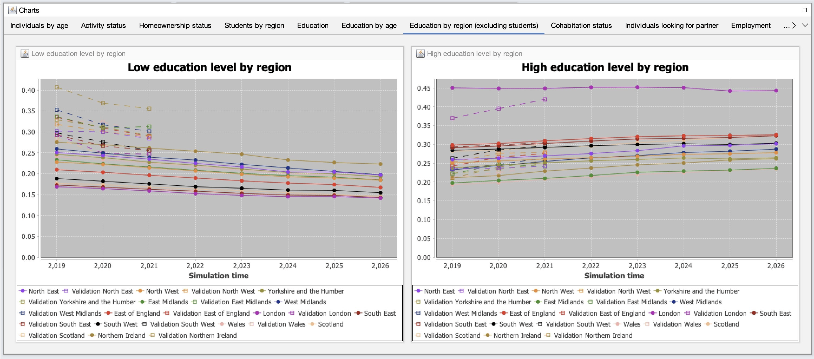

# GUI Guide

The GUI is available in single-run and multi-run workflows when enabled.

## Enable GUI

Single run:

```bash
java -jar singlerun.jar -g true
```

Multi run:

```bash
java -jar multirun.jar -config default.yml -g true
```

## Screenshots

Main GUI:


Control buttons:


Parameter selection:


Charts overview:



Chart properties:


Chart zoom example:


Output stream panel:


## Headless note

In remote servers or CI, run with `-g false`.
