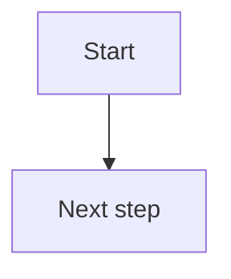

# SimPaths Flowcharts

This folder contains editable source files for SimPaths code-logic flowcharts.

These flowcharts are intended to document how the model code works. They should help developers understand, debug, review, and maintain important model processes. They should be traceable to Java classes, methods, scheduled processes, and model state.

The full workflow guide is:

```text
documentation/wiki/developer-guide/how-to/code-logic-flowcharts.md
```

## Folder Structure

Module-level and method-level flowcharts should be stored under:

```text
documentation/flowcharts/modules/
```

Example:

```text
documentation/flowcharts/modules/union_matching.md
```

Rendered SVG or PNG exports are optional. If they are needed for published documentation, store them under:

```text
documentation/wiki/figures/modules/
```

The editable Markdown file in `documentation/flowcharts/modules/` is the source of truth.

The module manifest is:

```text
documentation/flowcharts/modules.yml
```

Add or update a manifest entry whenever a flowchart file is added, removed, renamed, or its related code files, wiki links, or update triggers change.

## Module File Contents

Each module flowchart Markdown file should normally include:

- purpose of the flowchart;
- code references;
- schedule context, if relevant;
- state inputs;
- state changes;
- process-specific variable glossary;
- key branches, loops, fallback regimes, or alignment/test-run logic;
- embedded Mermaid flowchart;
- notes for debugging or future maintenance.

Use Mermaid code blocks inside the Markdown file:

````markdown

````

## Update Triggers

Update a flowchart file when the documented code logic changes: entry points, event order, method calls, branch conditions, loops, fallback regimes, alignment/test-run behavior, stochastic decisions, state inputs, state changes, or variable meanings.

Redraw the Mermaid diagram when control flow changes. Update notes or glossaries when explanations, assumptions, or variable meanings change.


## Current Flowcharts

See `modules.yml` for the traceability map between flowchart files, code files, wiki pages, and update triggers.

- `modules/inschool.md` - person-level in-school decision logic and leaving-school handoff.
- `modules/union_matching.md` - pair-based union matching logic and maintenance notes.
