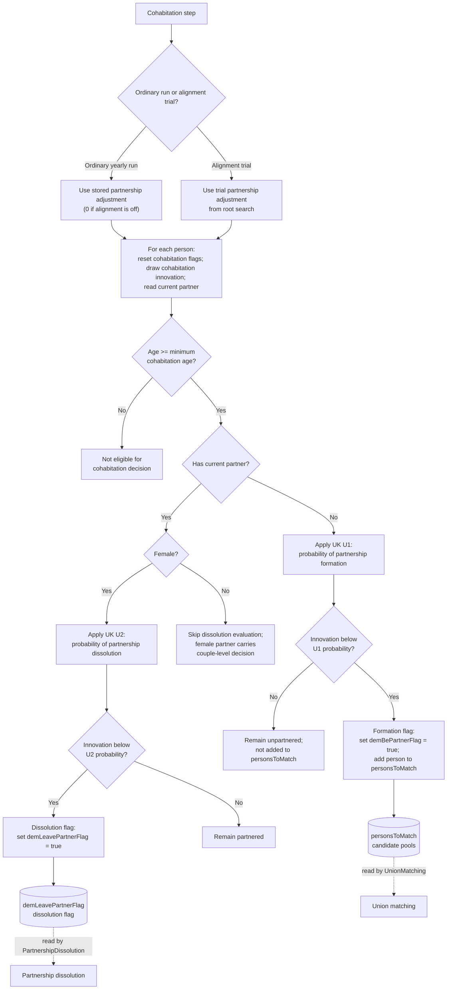

# Cohabitation Method Documentation: UK Case

## Overview

This document describes the UK branch of the `Person.cohabitation()` method and its immediate household-composition schedule context.

The flowchart is method-level. It focuses on the person-level UK decision that flags people for partnership formation, flags existing partnerships for dissolution, and populates the candidate pool used later by union matching.

The Java method also contains an Italy branch. That branch is intentionally outside the scope of this flowchart.

## Purpose

The `cohabitation()` process determines:

- whether an eligible unpartnered person enters the union matching candidate pool;
- whether an eligible partnered female is flagged to leave her current partner;
- how the partnership alignment adjustment enters the UK partnership regressions;
- which state is handed off to later partnership dissolution and union matching processes.

## Code References

- `src/main/java/simpaths/model/Person.java`
  - `Person.Processes.Cohabitation`
  - `Person.cohabitation()`
  - `Person.cohabitation(double probitAdjustment)`
  - `Person.partnershipDissolution()`
- `src/main/java/simpaths/model/SimPathsModel.java`
  - `buildSchedule()`
  - `Processes.CohabitationAlignment`
  - `Processes.UnionMatching`
  - `clearPersonsToMatch()`
  - `getPartnershipAdjustment()`
- `src/main/java/simpaths/model/PartnershipAlignment.java`
  - `PartnershipAlignment.evaluate(double[] args)`
- `src/main/java/simpaths/data/Parameters.java`
  - `MIN_AGE_COHABITATION`
  - `getRegPartnershipU1()`
  - `getRegPartnershipU2()`

## Schedule Context

In the household composition block, the relevant order is:

1. `SimPathsModel.Processes.CohabitationAlignment`
2. `Person.Processes.Cohabitation`
3. `Person.Processes.PartnershipDissolution`
4. `SimPathsModel.Processes.UnionMatching`

`CohabitationAlignment` may run trial cohabitation and test union matching to solve for a partnership adjustment. It then clears `personsToMatch`, so the ordinary yearly cohabitation pass starts from a clean candidate pool.

## State Inputs

- `demAge`: current age, checked against `MIN_AGE_COHABITATION`.
- `model.getCountry()`: this flowchart assumes the UK branch is active.
- `getPartner()`: determines whether the person is evaluated for partnership formation or dissolution.
- `demMaleFlag`: gender flag. Dissolution is evaluated for partnered females only.
- `probitAdjustment`: partnership alignment adjustment used in the UK branch.
- `statInnovations.getDoubleDraw(25)`: stochastic draw for formation or dissolution.
- partnership regressions: UK `U1` and `U2`.
- `model.getPersonsToMatch()`: gender/region candidate pools for later union matching.

## State Changes

At the start of `cohabitation(double)`:

- `demBePartnerFlag` is reset to false.
- `demLeavePartnerFlag` is reset to false.
- `demAlignPartnerProcess` is reset to false.

During the method:

- `demBePartnerFlag` may be set to true for an unpartnered person selected for partnership formation.
- a selected unpartnered person is added to `personsToMatch` by gender and region.
- `demLeavePartnerFlag` may be set to true for a partnered female selected for partnership dissolution.

No partnership, benefit-unit, or household structure is directly changed by this method.

## Variable Glossary

This glossary is process-specific. For the full variable dictionary, see `documentation/SimPaths_Variable_Codebook.xlsx`.

| Variable | Meaning in this flowchart |
|---|---|
| `demAge` | Person's current age. Cohabitation logic runs only from `MIN_AGE_COHABITATION` onward. |
| `MIN_AGE_COHABITATION` | Minimum age for the cohabitation decision. It is defined in `Parameters`. |
| `partner` | Current partner returned by `getPartner()`. A null partner leads to the formation branch; a non-null partner can lead to dissolution evaluation. |
| `demMaleFlag` | Gender flag. In the current code, partnered dissolution is evaluated only when this is `Gender.Female`. |
| `demBePartnerFlag` | Transient flag indicating that an unpartnered person was selected for possible partnership formation. |
| `demLeavePartnerFlag` | Transient flag indicating that a partnered female was selected for partnership dissolution. It is consumed by `partnershipDissolution()`. |
| `demAlignPartnerProcess` | Alignment/test-partner flag reset here. Test matching can set related alignment state later. |
| `personsToMatch` | Gender/region candidate pools populated here and consumed by union matching. |
| `probitAdjustment` | Partnership alignment adjustment. In the UK branch it is added to U1 formation scores and subtracted from U2 dissolution scores. |
| `cohabitInnov` | Stochastic draw from `statInnovations.getDoubleDraw(25)`. A positive outcome occurs when the draw is below the relevant probability. |
| `U1` | UK regression for partnership formation among unpartnered persons. |
| `U2` | UK regression for partnership dissolution among partnered females. |

## Key Branches

- Ordinary yearly run versus alignment trial.
- Age eligible versus below cohabitation age.
- Unpartnered formation branch versus partnered dissolution branch.
- Female-only dissolution evaluation for partnered persons.
- Stochastic draw below or above the relevant probability.

## Flowchart

## Diagram Conventions

- Solid arrows show method control flow.
- Dotted arrows show downstream state handoffs.
- Rounded state nodes show model state written by this method and read by later scheduled processes.
- Multi-action boxes use separate lines so readers can see distinct state updates inside one code block.

## Alignment Context

The ordinary scheduled `cohabitation()` call uses `model.getPartnershipAdjustment()`. If cohabitation alignment is off, this returns `0.0`; otherwise it returns the stored or frozen partnership alignment value.

`PartnershipAlignment.evaluate(double[] args)` calls `person.cohabitation(args[0])` during root search. It then runs test union matching to calculate the simulated share of partnered persons. This alignment trial does not directly replace the ordinary yearly cohabitation pass.

## Notes for Debugging

- `cohabitation()` does not create couples. It only marks candidates and writes `personsToMatch`.
- `cohabitation()` does not separate couples. It only sets `demLeavePartnerFlag`; `partnershipDissolution()` applies the separation later in the schedule.
- UK formation uses `score + probitAdjustment`; UK dissolution uses `score - probitAdjustment`.
- Partnered males are not evaluated for dissolution in this method. The female partner carries the dissolution decision.
- The Italy branch exists in `Person.cohabitation(double)`, but is intentionally not documented in this UK-focused flowchart.
- If union matching has unexpected candidate counts, check both `CohabitationAlignment` clearing of `personsToMatch` and the ordinary cohabitation pass.

## Flowchart Maintenance Guidance

Update this flowchart when any of the following change:

- the UK branch structure in `Person.cohabitation(double)` changes;
- `MIN_AGE_COHABITATION` changes;
- UK partnership regression calls change;
- the partnership adjustment is applied differently;
- `demBePartnerFlag`, `demLeavePartnerFlag`, or `demAlignPartnerProcess` handling changes;
- `personsToMatch` construction changes;
- `PartnershipAlignment.evaluate()` stops reusing `Person.cohabitation(double)`;
- the downstream handoff to `partnershipDissolution()` or union matching changes.

Keep this diagram method-level. Broader schedule interactions should remain in `documentation/flowcharts/modules/household_composition.md`.
