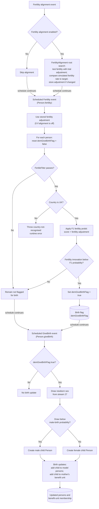

# Fertility and GiveBirth Method Documentation

## Overview

This document describes the combined logic of `Person.fertility()` and `Person.giveBirth()`.

The flowchart is method-level with schedule context. It shows how fertility decisions set `demGiveBirthFlag`, and how the later give-birth process reads that flag to create and attach a newborn child.

## Purpose

This flowchart clarifies:

- how optional fertility alignment reuses `Person.fertility(double probitAdjustment)`;
- how the ordinary yearly fertility run uses the stored fertility adjustment;
- which persons are eligible under `FertileFilter`;
- how fertility process F1 sets `demGiveBirthFlag`;
- how `giveBirth()` creates a child only for persons flagged to give birth;
- how newborn sex is drawn and the child is added to model state.

## Code References

- `src/main/java/simpaths/model/Person.java`
  - `Person.Processes.Fertility`
  - `Person.Processes.GiveBirth`
  - `Person.fertility()`
  - `Person.fertility(double probitAdjustment)`
  - `Person.giveBirth()`
  - `Person.isToGiveBirth()`
  - `Person.setToGiveBirth(boolean toGiveBirth_)`
- `src/main/java/simpaths/model/SimPathsModel.java`
  - `buildSchedule()`
  - `Processes.FertilityAlignment`
  - `fertilityAlignment()`
  - `getFertilityAdjustment()`
- `src/main/java/simpaths/model/FertilityAlignment.java`
  - `FertilityAlignment.evaluate(double[] args)`
  - `evalFertilityRate()`
- `src/main/java/simpaths/data/filters/FertileFilter.java`
  - `FertileFilter.evaluate(...)`
- `src/main/java/simpaths/data/Parameters.java`
  - `getRegFertilityF1()`
  - `MIN_AGE_MATERNITY`
  - `MAX_AGE_MATERNITY`
  - `FLAG_SINGLE_MOTHERS`
  - `PROB_NEWBORN_IS_MALE`

## Schedule Context

In the household composition block, fertility and birth are scheduled after partnership dissolution and union matching:

1. `SimPathsModel.Processes.FertilityAlignment`
2. `Person.Processes.Fertility`
3. `Person.Processes.GiveBirth`

`GiveBirth` is scheduled as a non-read-only collection event because newborn children modify the `persons` collection.

## State Inputs

- `alignFertility`: controls whether fertility alignment runs.
- `fertilityAdjustment`: stored or frozen fertility alignment adjustment used by ordinary fertility.
- `probitAdjustment`: trial adjustment used during fertility alignment.
- `FertileFilter`: checks gender, region where relevant, maternity age range, and partner/single-mother eligibility.
- `model.getCountry()`: current code recognises the UK fertility branch and throws otherwise.
- `Parameters.getRegFertilityF1()`: fertility probit regression.
- `statInnovations.getDoubleDraw(29)`: stochastic draw for fertility outcome.
- `statInnovations.getDoubleDraw(27)`: stochastic draw for newborn sex.
- `PROB_NEWBORN_IS_MALE`: threshold for assigning newborn sex.
- current `benefitUnit`: receives the newborn child.

## State Changes

Within `fertility(double)`:

- `demGiveBirthFlag` is reset to false at the start.
- if the person is fertile and the fertility draw is below the F1 probability, `demGiveBirthFlag` is set to true.

Within `giveBirth()`:

- if `demGiveBirthFlag` is true, newborn sex is drawn;
- a new `Person` child is created;
- the child is added to `model.getPersons()`;
- the child is added to the mother's `benefitUnit.getMembers()`.

`giveBirth()` does not reset `demGiveBirthFlag`; the flag is reset at the next fertility evaluation.

## Variable Glossary

This glossary is process-specific. For the full variable dictionary, see `documentation/SimPaths_Variable_Codebook.xlsx`.

| Variable | Meaning in this flowchart |
|---|---|
| `demGiveBirthFlag` | Transient flag set by `fertility()` and consumed by `giveBirth()`. |
| `FertileFilter` | Eligibility filter for fertility. Requires female sex, maternity age range, and either a partner or `FLAG_SINGLE_MOTHERS`. |
| `MIN_AGE_MATERNITY` / `MAX_AGE_MATERNITY` | Age range used by `FertileFilter`. |
| `FLAG_SINGLE_MOTHERS` | Allows fertility eligibility without a partner when true. |
| `probitAdjustment` | Fertility alignment adjustment added to the F1 regression score. |
| `F1` | Fertility probit process used in the current UK branch. |
| `PROB_NEWBORN_IS_MALE` | Probability threshold for assigning newborn sex as male. |
| `benefitUnit` | Mother's benefit unit. The newborn child is added to this unit. |

## Key Branches

- Fertility alignment enabled versus skipped.
- Ordinary yearly fertility run versus alignment trial.
- Fertile versus not fertile under `FertileFilter`.
- UK country branch versus unrecognised country.
- Fertility draw below versus above F1 probability.
- Give-birth flag true versus false.
- Newborn sex male versus female.

## Flowchart

## Diagram Conventions

- Solid arrows show schedule or method control flow.
- Rounded state nodes show model state written by the process.
- The `schedule continues` label marks separate scheduled events rather than direct method calls.
- Multi-action boxes use separate lines so readers can distinguish state updates.

## Alignment Context

`FertilityAlignment.evaluate(double[] args)` calls `person.fertility(args[0])` for all persons during root search. It then compares the simulated fertility rate, measured as births among fertile persons, to the target fertility rate.

The ordinary scheduled `fertility()` call later uses `model.getFertilityAdjustment()`. If fertility alignment is off, this adjustment is `0.0`; after the alignment end year, the frozen alignment value is used.

## Notes for Debugging

- `fertility()` resets `demGiveBirthFlag` before checking eligibility.
- `FertileFilter` currently requires `Gender.Female`, maternity age range, and either a current partner or `FLAG_SINGLE_MOTHERS`.
- In the current active branch, fertility is implemented for `Country.UK`; other countries throw a runtime error in `fertility(double)`.
- `giveBirth()` does not make a fertility decision. It only reads `demGiveBirthFlag`.
- `giveBirth()` creates a new `Person` using newborn sex and the mother, adds it to the model persons collection, and adds it to the mother's benefit unit.
- The newborn constructor uses the mother's fertility random stream for the child's seed; this is part of child creation rather than the fertility decision itself.
- `demGiveBirthFlag` is not reset inside `giveBirth()`. It is reset at the start of the next fertility evaluation.

## Flowchart Maintenance Guidance

Update this flowchart when any of the following change:

- fertility or give-birth schedule order changes;
- fertility alignment timing or adjustment handling changes;
- `FertileFilter` eligibility changes;
- country-specific fertility branch logic changes;
- F1 regression, adjustment, or random stream handling changes;
- `demGiveBirthFlag` is set, reset, or consumed differently;
- newborn sex assignment changes;
- child creation, model-person insertion, or benefit-unit membership updates change.

Keep this file focused on the combined `fertility()` and `giveBirth()` handoff. Broader schedule context belongs in `documentation/flowcharts/modules/household_composition.md`.
