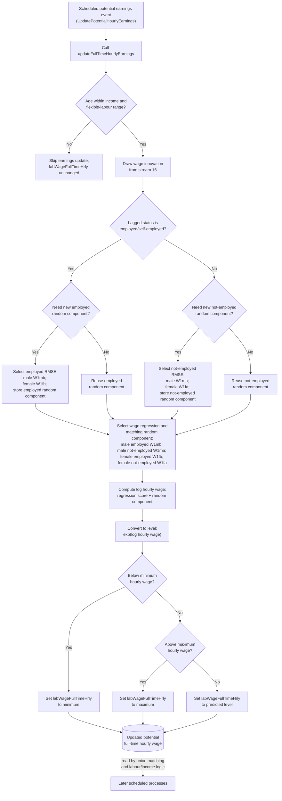

# Full-Time Hourly Earnings Update Documentation

## Overview

This document describes the `Person.updateFullTimeHourlyEarnings()` method and its scheduled `Person.Processes.UpdatePotentialHourlyEarnings` event.

The flowchart is method-level. It focuses on the yearly update of potential full-time hourly earnings, stored in `labWageFullTimeHrly`.

## Purpose

The full-time hourly earnings update determines:

- whether a person is inside the age range for potential earnings updates;
- whether the wage equation uses the lagged-employed or lagged-not-employed branch;
- whether the stochastic wage-regression component is newly drawn or reused;
- which gender and lagged-employment wage regression is selected;
- how the log wage is converted to an hourly wage level and bounded.

## Code References

- `src/main/java/simpaths/model/Person.java`
  - `Person.Processes.UpdatePotentialHourlyEarnings`
  - `Person.onEvent(Enum<?> type)`
  - `Person.updateFullTimeHourlyEarnings()`
  - `Person.initialisePotentialHourlyEarnings()`
  - `Person.setLabWageFullTimeHrly(double potentialHourlyEarnings)`
  - `Person.updateLaggedVariables(boolean initialUpdate)`
- `src/main/java/simpaths/model/SimPathsModel.java`
  - `buildSchedule()`
  - scheduled `Person.Processes.UpdatePotentialHourlyEarnings`
  - `fixRegressionStochasticComponent`
- `src/main/java/simpaths/data/Parameters.java`
  - `MIN_AGE_TO_HAVE_INCOME`
  - `MAX_AGE_FLEXIBLE_LABOUR_SUPPLY`
  - `MIN_HOURLY_WAGE_RATE`
  - `MAX_HOURLY_WAGE_RATE`
  - `getRegWagesMalesE()`
  - `getRegWagesMalesNE()`
  - `getRegWagesFemalesE()`
  - `getRegWagesFemalesNE()`
  - `getRMSEForRegression(...)`

## Schedule Context

In `SimPathsModel.buildSchedule()`, `Person.Processes.UpdatePotentialHourlyEarnings` runs in the household composition block immediately before cohabitation alignment, cohabitation decisions, partnership dissolution, and union matching.

This order matters because updated `labWageFullTimeHrly` can be used later by matching and labour-market/income logic.

Lagged potential hourly earnings, `labWageFullTimeHrlyL1`, are updated elsewhere by `updateLaggedVariables(boolean initialUpdate)`, not inside `updateFullTimeHourlyEarnings()`.

## State Inputs

- `demAge`: checked against `MIN_AGE_TO_HAVE_INCOME` and `MAX_AGE_FLEXIBLE_LABOUR_SUPPLY`.
- `labC4L1`: lagged labour/economic status; selects employed versus not-employed wage branch.
- `demMaleFlag`: selects male or female wage equation and RMSE.
- `statInnovations.getDoubleDraw(16)`: stochastic draw for the wage random component.
- `model.fixRegressionStochasticComponent`: controls whether an existing wage random component is reused.
- `labWageRegressRandomCompoponentEmp`: cached stochastic component for the lagged-employed branch.
- `labWageRegressRandomCompoponentNotEmp`: cached stochastic component for the lagged-not-employed branch.
- wage regressions and RMSEs: `W1mb`, `W1ma`, `W1fb`, and `W1fa`.

## State Changes

Within `updateFullTimeHourlyEarnings()`:

- `labWageRegressRandomCompoponentEmp` may be drawn or reused for the lagged-employed branch.
- `labWageRegressRandomCompoponentNotEmp` may be drawn or reused for the lagged-not-employed branch.
- `labWageFullTimeHrly` is set to the exponentiated predicted hourly wage, bounded by `MIN_HOURLY_WAGE_RATE` and `MAX_HOURLY_WAGE_RATE`.

If the person is outside the income/flexible-labour age range, the method returns without updating `labWageFullTimeHrly`.

## Variable Glossary

This glossary is process-specific. For the full variable dictionary, see `documentation/SimPaths_Variable_Codebook.xlsx`.

| Variable | Meaning in this flowchart |
|---|---|
| `labWageFullTimeHrly` | Potential full-time hourly wage. This is the main output of the method. |
| `labWageFullTimeHrlyL1` | Lagged potential full-time hourly wage. Updated in lagged-variable maintenance, not in this method. |
| `labC4L1` | Lagged four-category labour/economic status. Used to choose employed versus not-employed wage branch. |
| `demMaleFlag` | Gender flag. Used to choose male or female wage equations and RMSEs. |
| `wagesInnov` | Random draw from stream 16, transformed to a standard-normal shock. |
| `labWageRegressRandomCompoponentEmp` | Cached stochastic component for the lagged-employed wage branch. |
| `labWageRegressRandomCompoponentNotEmp` | Cached stochastic component for the lagged-not-employed wage branch. |
| `fixRegressionStochasticComponent` | Model switch. If true, an existing stochastic wage component is reused instead of redrawn. |
| `W1mb` | Male, lagged-employed wage equation and RMSE key. |
| `W1ma` | Male, lagged-not-employed wage equation and RMSE key. |
| `W1fb` | Female, lagged-employed wage equation and RMSE key. |
| `W1fa` | Female, lagged-not-employed wage equation and RMSE key. |

## Key Branches

- Within earnings-update age range versus outside it.
- Lagged employed/self-employed versus lagged not employed/self-employed.
- New stochastic component needed versus cached component reused.
- Male versus female wage equation.
- Predicted hourly wage below minimum, above maximum, or within bounds.

## Flowchart

## Diagram Conventions

- Solid arrows show method control flow.
- Dotted arrows show downstream state handoffs.
- Rounded state nodes show model state written by this method.
- Multi-action boxes use separate lines so readers can distinguish the wage-equation cases.

## Notes for Debugging

- The age gate returns before drawing or setting wage state when the person is outside the income/flexible-labour age range.
- `labC4L1`, not current `labC4`, selects the employed versus not-employed wage branch.
- The stochastic component is stored separately for lagged-employed and lagged-not-employed branches.
- If `fixRegressionStochasticComponent` is true and the relevant component already exists, the method reuses it. Otherwise, it draws a new component.
- The selected wage equation and the selected RMSE use the same branch keys: `W1mb`, `W1ma`, `W1fb`, and `W1fa`.
- The method predicts a log hourly wage, exponentiates it, and clamps the result to the configured hourly wage bounds.
- `labWageFullTimeHrlyL1` is not updated here. It is updated by lagged-variable maintenance.

## Flowchart Maintenance Guidance

Update this flowchart when any of the following change:

- age eligibility for potential earnings changes;
- lagged employment status no longer controls the wage branch;
- gender-specific wage regressions or RMSE keys change;
- stochastic component caching or `fixRegressionStochasticComponent` handling changes;
- wage level conversion or min/max bounding changes;
- `labWageFullTimeHrly` or `labWageFullTimeHrlyL1` update responsibilities change;
- schedule order around `Person.Processes.UpdatePotentialHourlyEarnings` changes.

Keep this file focused on `updateFullTimeHourlyEarnings()`. Initialisation through `initialisePotentialHourlyEarnings()` should be documented separately if needed.
