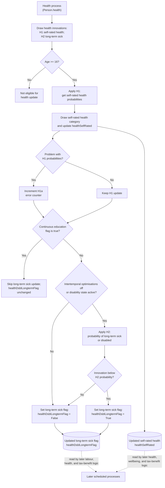

# Health and Long-Term Sick Method Documentation

## Overview

This document describes the `Person.health()` process in the SimPaths health module.

The flowchart is method-level. It focuses on the yearly update of self-rated health and the conditional update of the long-term sick or disabled flag. It does not cover the later mental-health, SF12, life-satisfaction, or EQ5D processes.

## Purpose

The `health()` process determines:

- whether a person is old enough for the health update;
- how self-rated health is drawn from the H1 regression probabilities;
- whether the H1 probability draw produced a regression-probability error counter update;
- whether the person is eligible for the long-term sick or disabled update;
- whether the H2 disability regression is evaluated under the current optimisation/disability-state settings;
- how the long-term sick or disabled flag is set for eligible persons.

## Code References

- `src/main/java/simpaths/model/Person.java`
  - `Person.Processes.Health`
  - `Person.health()`
  - `Person.updateLaggedVariables(boolean initialUpdate)`
  - `Person.getDhe()`
  - `Person.getDlltsd()`
- `src/main/java/simpaths/model/SimPathsModel.java`
  - `buildSchedule()`
  - yearly `Person.Processes.Health` collection event
- `src/main/java/simpaths/data/Parameters.java`
  - `getRegHealthH2()`
  - `enableIntertemporalOptimisations`
- `src/main/java/simpaths/data/ManagerRegressions.java`
  - `getProbabilities(..., RegressionName.HealthH1)`
- `src/main/java/simpaths/model/decisions/DecisionParams.java`
  - `flagDisability`

## Schedule Context

In `SimPathsModel.buildSchedule()`, `Person.Processes.Health` runs after the education module and before the household composition module.

This order matters because:

- `health()` reads education-related state, including `ded`;
- `health()` updates `healthSelfRated` and possibly `healthDsblLongtermFlag`;
- later labour-market, income, tax-benefit, mental-health, and wellbeing processes can read health and disability state.

Lagged health and long-term sick status are updated elsewhere by `updateLaggedVariables(boolean initialUpdate)`, not inside `health()`.

## State Inputs

- `demAge`: current age. The process updates health only for persons aged 16 or older.
- `ded` / `eduSpellFlag`: continuous education flag. A true value skips H2; H2 is evaluated only when `ded` is explicitly false.
- `statInnovations.getDoubleDraw(3)`: stochastic draw for self-rated health H1.
- `statInnovations.getDoubleDraw(4)`: stochastic draw for long-term sick or disabled H2.
- H1 probabilities from `ManagerRegressions.getProbabilities(this, RegressionName.HealthH1)`.
- H2 probability from `Parameters.getRegHealthH2().getProbability(this, Person.DoublesVariables.class)`.
- `Parameters.enableIntertemporalOptimisations`: controls whether H2 may be suppressed.
- `DecisionParams.flagDisability`: allows H2 evaluation when intertemporal optimisations are enabled.

## State Changes

Within `health()`:

- `healthSelfRated` is updated from the H1 multinomial event for persons aged 16 or older.
- `model.addCounterErrorH1a()` is called if the H1 event reports a problem with probabilities.
- `healthDsblLongtermFlag` is set to `Indicator.True` or `Indicator.False` only when the person is aged 16 or older and `ded` is explicitly false.

If the person is under age 16, `health()` makes no update. If `ded` is not explicitly false, the long-term sick or disabled flag is not changed by this method.

## Variable Glossary

This glossary is process-specific. For the full variable dictionary, see `documentation/SimPaths_Variable_Codebook.xlsx`.

| Variable | Meaning in this flowchart |
|---|---|
| `demAge` | Person's current age. Health H1 and long-term sick H2 logic run only from age 16 onward. |
| `healthSelfRated` / `dhe` | Self-rated health category, represented by the `Dhe` enum. Updated by H1. |
| `healthDsblLongtermFlag` / `dlltsd` | Long-term sick or disabled indicator. Updated by H2 only for eligible persons. |
| `ded` / `eduSpellFlag` | Continuous education indicator. H2 is skipped when this is true and evaluated only when this is `Indicator.False`. |
| `healthInnov1` | Random draw from stream 3 used to select the H1 self-rated health category. |
| `healthInnov2` | Random draw from stream 4 used for the H2 long-term sick or disabled decision. |
| `H1` | Generalised ordered regression for self-rated health probabilities. |
| `H2` | Binomial probit regression for long-term sick or disabled status. |
| `enableIntertemporalOptimisations` | Global switch that can suppress disability updating unless disability is active in the decision state. |
| `DecisionParams.flagDisability` | Decision-model switch controlling whether disability is included when intertemporal optimisations are enabled. |

## Key Branches

- Age 16 or older versus under age 16.
- H1 probability event normal versus probability problem counter update.
- Continuous education flag true versus explicitly false.
- H2 evaluated because intertemporal optimisations are off or disability is included in the decision state.
- H2 stochastic draw below versus above the predicted probability.

## Flowchart

## Diagram Conventions

- Solid arrows show method control flow.
- Dotted arrows show downstream state handoffs.
- Rounded state nodes show model state written by this method and read by later processes.
- Multi-action boxes use separate lines so readers can distinguish distinct updates.

## Notes for Debugging

- `health()` always draws both H1 and H2 innovations before the age check, but uses them only inside the relevant branches.
- H1 updates `healthSelfRated` for persons aged 16 or older.
- H2 updates `healthDsblLongtermFlag` only when `Indicator.False.equals(getDed())` is true. If `ded` is true or null, this method leaves the long-term sick flag unchanged.
- H2 is evaluated only when intertemporal optimisations are off or `DecisionParams.flagDisability` is true.
- When intertemporal optimisations are enabled and `DecisionParams.flagDisability` is false, H2 is not evaluated for eligible persons and the long-term sick flag is set to false.
- The H1 probability-problem branch does not undo the H1 health draw. It only increments the model error counter.
- `updateLaggedVariables(boolean initialUpdate)` updates `healthSelfRatedL1` and `healthDsblLongtermFlagL1`; those lagged fields are not written inside `health()`.
- Later mental-health, SF12, life-satisfaction, and EQ5D processes are separate scheduled processes and should be documented in separate flowcharts if needed.

## Flowchart Maintenance Guidance

Update this flowchart when any of the following change:

- age eligibility for H1 or H2 changes;
- H1 regression or probability-event handling changes;
- H2 regression or stochastic decision logic changes;
- `ded` no longer controls the H2 branch;
- intertemporal-optimisation or `DecisionParams.flagDisability` handling changes;
- `healthSelfRated` or `healthDsblLongtermFlag` state updates change;
- schedule order around `Person.Processes.Health` changes;
- downstream handoffs to later health, labour, or tax-benefit processes change.

Keep this diagram focused on `Person.health()`. Document mental health, SF12, life satisfaction, and EQ5D in separate files if those modules become debugging targets.
