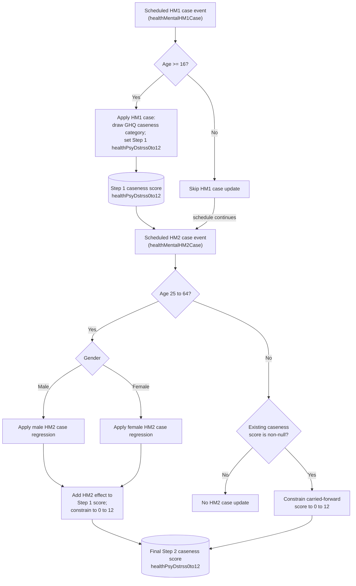

# Health Mental HM1 and HM2 Case Methods Documentation

## Overview

This document describes the active `Person.healthMentalHM1Case()` and `Person.healthMentalHM2Case()` methods for GHQ-12 psychological distress caseness.

The case-based mental-health logic is split into two scheduled steps:

1. `Person.healthMentalHM1Case()`
2. `Person.healthMentalHM2Case()`

There is also a legacy enum entry, `Person.Processes.HealthMentalHM1HM2Cases`, but it is marked "no longer used", is not scheduled, and has no `onEvent` branch. It is noted here only to avoid confusion.

## Purpose

This flowchart clarifies:

- how HM1 case initializes psychological distress caseness for persons aged 16 or older;
- how HM2 case applies age- and gender-specific exposure effects for persons aged 25 to 64;
- how the Step 1 caseness score becomes the final Step 2 caseness score;
- where `healthPsyDstrss0to12` is updated.

## Code References

- `src/main/java/simpaths/model/Person.java`
  - `Person.Processes.HealthMentalHM1Case`
  - `Person.Processes.HealthMentalHM2Case`
  - `Person.onEvent(Enum<?> type)`
  - `Person.healthMentalHM1Case()`
  - `Person.healthMentalHM2Case()`
  - `Person.constrainhealthPsyDstrssEstimate(Double healthPsyDstrss0to12)`
- `src/main/java/simpaths/model/SimPathsModel.java`
  - `buildSchedule()`
  - scheduled `Person.Processes.HealthMentalHM1Case`
  - scheduled `Person.Processes.HealthMentalHM2Case`
- `src/main/java/simpaths/data/Parameters.java`
  - `getRegHealthHM1Case()`
  - `getRegHealthHM2CaseMales()`
  - `getRegHealthHM2CaseFemales()`
- `src/main/java/simpaths/data/ManagerRegressions.java`
  - `getProbabilities(..., RegressionName.HealthHM1Case)`

## Schedule Context

The current mental-health schedule in `SimPathsModel.buildSchedule()` includes:

1. `Person.Processes.HealthMentalHM1`
2. `Person.Processes.HealthMentalHM2`
3. `Person.Processes.HealthMentalHM1Case`
4. `Person.Processes.HealthMentalHM2Case`

`HealthMentalHM1HM2Cases` is not scheduled. The enum entry is retained in `Person.Processes`, but the active case-based update is performed by the two separate scheduled events.

## State Inputs

- `demAge`: age eligibility for HM1 case and HM2 case.
- `demMaleFlag`: selects male or female HM2 case regression.
- `statInnovations.getDoubleDraw(36)`: stochastic draw for HM1 case.
- `RegressionName.HealthHM1Case`: ordered-logit case regression for baseline psychological distress.
- `Parameters.getRegHealthHM2CaseMales()`: male HM2 case linear regression.
- `Parameters.getRegHealthHM2CaseFemales()`: female HM2 case linear regression.
- lagged and current covariates read through `Person.DoublesVariables`.

## State Changes

Within the active path:

- `healthMentalHM1Case()` may set the Step 1 `healthPsyDstrss0to12` caseness score for persons aged 16 or older.
- `healthMentalHM2Case()` may update the Step 1 score into the final Step 2 `healthPsyDstrss0to12` score for persons aged 25 to 64 using gender-specific regression effects.
- `healthMentalHM2Case()` constrains `healthPsyDstrss0to12` to the valid 0 to 12 range when it updates or when a non-null value is carried forward outside the 25 to 64 age range.

The legacy `HealthMentalHM1HM2Cases` entry does not update state in the current code because there is no implemented event branch or method body for it.

## Variable Glossary

This glossary is process-specific. For the full variable dictionary, see `documentation/SimPaths_Variable_Codebook.xlsx`.

| Variable | Meaning in this flowchart |
|---|---|
| `healthPsyDstrss0to12` | GHQ-12 psychological distress caseness score, stored on a 0 to 12 scale. HM1 case writes the Step 1 score; HM2 case updates or constrains the final score. |
| `demAge` | Person's current age. HM1 case applies from age 16; HM2 case applies from age 25 to 64. |
| `demMaleFlag` | Gender flag used to choose the male or female HM2 case regression. |
| `DhmGhq` | Enum used by the HM1 case ordered-logit draw. Its value is converted to `healthPsyDstrss0to12`. |
| `HM1Case` | Baseline ordered-logit process for psychological distress caseness. |
| `HM2Case` | Second-step linear adjustment process for psychological distress caseness. |

## Key Branches

- HM1 case age 16 or older versus under age 16.
- HM2 case age 25 to 64 versus outside that age range.
- Male versus female HM2 case regression.
- Non-null carried-forward caseness score outside the HM2 age range.

## Flowchart

## Diagram Conventions

- Solid arrows show current control flow or schedule order.
- Rounded state nodes show model state written by the active path.

## Notes for Debugging

- The active path first writes the Step 1 case score through `healthMentalHM1Case()`, then applies HM2 case adjustments through `healthMentalHM2Case()` to produce the final Step 2 case score.
- Do not look for a `healthMentalHM1HM2Cases()` method in the current `Person` class; it is not present.
- `Person.Processes.HealthMentalHM1HM2Cases` remains in the enum but is marked as no longer used.
- `Person.onEvent(...)` has branches for `HealthMentalHM1Case` and `HealthMentalHM2Case`, but not for `HealthMentalHM1HM2Cases`.
- If the legacy enum entry is removed, this documentation should either be deleted or replaced by documentation for the active HM1/HM2 case sequence only.

## Flowchart Maintenance Guidance

Update this flowchart when any of the following change:

- a `healthMentalHM1HM2Cases()` method is added;
- the active schedule for `HealthMentalHM1Case` or `HealthMentalHM2Case` changes;
- age eligibility for HM1 case or HM2 case changes;
- gender-specific HM2 case regression handling changes;
- `healthPsyDstrss0to12` update or constraint logic changes.

Keep this file focused on the active split case processes. Mention the inactive legacy enum only when it helps avoid confusion.
