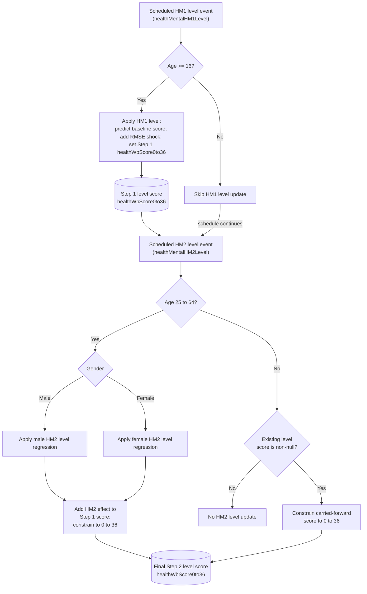

# Health Mental HM1 and HM2 Level Methods Documentation

## Overview

This document describes the active `Person.healthMentalHM1Level()` and `Person.healthMentalHM2Level()` methods for GHQ-12 psychological distress on the Likert level scale.

The level-based mental-health logic is split into two scheduled steps:

1. `Person.healthMentalHM1Level()`
2. `Person.healthMentalHM2Level()`

This is parallel to the case-based flowchart in `documentation/flowcharts/modules/health_mental_hm1_hm2_cases.md`.

## Purpose

This flowchart clarifies:

- how HM1 level initializes the Step 1 GHQ-12 level score for persons aged 16 or older;
- how HM2 level applies age- and gender-specific exposure effects for persons aged 25 to 64;
- how the Step 1 level score becomes the final Step 2 level score;
- where `healthWbScore0to36` is updated.

## Code References

- `src/main/java/simpaths/model/Person.java`
  - `Person.Processes.HealthMentalHM1`
  - `Person.Processes.HealthMentalHM2`
  - `Person.onEvent(Enum<?> type)`
  - `Person.healthMentalHM1Level()`
  - `Person.healthMentalHM2Level()`
  - `Person.constrainDhmEstimate(Double healthWbScore0to36)`
- `src/main/java/simpaths/model/SimPathsModel.java`
  - `buildSchedule()`
  - scheduled `Person.Processes.HealthMentalHM1`
  - scheduled `Person.Processes.HealthMentalHM2`
- `src/main/java/simpaths/data/Parameters.java`
  - `getRegHealthHM1Level()`
  - `getRegHealthHM2LevelMales()`
  - `getRegHealthHM2LevelFemales()`
  - `getRMSEForRegression("HM1_L")`

## Schedule Context

The current mental-health schedule in `SimPathsModel.buildSchedule()` includes:

1. `Person.Processes.HealthMentalHM1`
2. `Person.Processes.HealthMentalHM2`
3. `Person.Processes.HealthMentalHM1Case`
4. `Person.Processes.HealthMentalHM2Case`

The level score is updated first through HM1/HM2 level methods. The case score is then updated separately through HM1/HM2 case methods.

## State Inputs

- `demAge`: age eligibility for HM1 level and HM2 level.
- `demMaleFlag`: selects male or female HM2 level regression.
- `statInnovations.getDoubleDraw(1)`: stochastic draw converted to a standard-normal shock for HM1 level.
- `Parameters.getRegHealthHM1Level()`: baseline linear regression for the Step 1 GHQ-12 level score.
- `Parameters.getRMSEForRegression("HM1_L")`: residual variation used in the Step 1 level score.
- `Parameters.getRegHealthHM2LevelMales()`: male HM2 level linear regression.
- `Parameters.getRegHealthHM2LevelFemales()`: female HM2 level linear regression.
- lagged and current covariates read through `Person.DoublesVariables`.

## State Changes

Within the active path:

- `healthMentalHM1Level()` may set the Step 1 `healthWbScore0to36` level score for persons aged 16 or older.
- `healthMentalHM2Level()` may update the Step 1 score into the final Step 2 `healthWbScore0to36` score for persons aged 25 to 64 using gender-specific regression effects.
- `healthMentalHM2Level()` constrains `healthWbScore0to36` to the valid 0 to 36 range when it updates or when a non-null value is carried forward outside the 25 to 64 age range.

## Variable Glossary

This glossary is process-specific. For the full variable dictionary, see `documentation/SimPaths_Variable_Codebook.xlsx`.

| Variable | Meaning in this flowchart |
|---|---|
| `healthWbScore0to36` | GHQ-12 psychological distress Likert level score, stored on a 0 to 36 scale. HM1 level writes the Step 1 score; HM2 level updates or constrains the final score. |
| `demAge` | Person's current age. HM1 level applies from age 16; HM2 level applies from age 25 to 64. |
| `demMaleFlag` | Gender flag used to choose the male or female HM2 level regression. |
| `HM1_L` | Baseline level process for GHQ-12 psychological distress. The code uses the HM1 level regression score plus RMSE noise. |
| `HM2_Males_L` / `HM2_Females_L` | Gender-specific second-step level adjustment processes. |
| `gauss` | Standard-normal shock generated from random stream 1 and used in the Step 1 level score. |

## Key Branches

- HM1 level age 16 or older versus under age 16.
- HM2 level age 25 to 64 versus outside that age range.
- Male versus female HM2 level regression.
- Non-null carried-forward level score outside the HM2 age range.

## Flowchart

## Diagram Conventions

- Solid arrows show current control flow or schedule order.
- Rounded state nodes show model state written by the active path.

## Notes for Debugging

- The active path first writes the Step 1 level score through `healthMentalHM1Level()`, then applies HM2 level adjustments through `healthMentalHM2Level()` to produce the final Step 2 level score.
- HM1 level uses a linear regression score plus an RMSE-scaled standard-normal shock.
- HM2 level does not replace the Step 1 score. It adds a gender-specific HM2 prediction to the current `healthWbScore0to36`, then constrains the result to 0 to 36.
- If age is outside 25 to 64 and `healthWbScore0to36` is already non-null, HM2 level only constrains the carried-forward value.
- The case-based GHQ-12 score `healthPsyDstrss0to12` is updated separately in `healthMentalHM1Case()` and `healthMentalHM2Case()`.

## Flowchart Maintenance Guidance

Update this flowchart when any of the following change:

- the active schedule for `HealthMentalHM1` or `HealthMentalHM2` changes;
- age eligibility for HM1 level or HM2 level changes;
- HM1 level regression, RMSE, or random stream handling changes;
- gender-specific HM2 level regression handling changes;
- `healthWbScore0to36` update or constraint logic changes.

Keep this file focused on the active split level processes. Document the case-based GHQ-12 process separately in `documentation/flowcharts/modules/health_mental_hm1_hm2_cases.md`.
