# Household Composition Module Documentation

## Overview

This document describes the scheduled household composition block in `SimPathsModel.buildSchedule()`.

The flowchart is module-level. It shows the yearly sequence that updates partnership formation, partnership dissolution, union matching, fertility, and births. It does not replace the more detailed union matching flowchart in `documentation/flowcharts/modules/union_matching.md`.

## Purpose

The household composition module updates family and household structure during each simulated year. It determines:

- who is considered for partnership formation;
- whether partnership alignment should adjust formation probabilities;
- which existing couples dissolve;
- how candidate partners are matched into couples;
- which fertile persons are flagged to give birth;
- whether fertility alignment should adjust birth probabilities;
- which newborn persons are created and added to benefit units.

## Code References

- `src/main/java/simpaths/model/SimPathsModel.java`
  - `buildSchedule()`
  - `Processes.CohabitationAlignment`
  - `Processes.UnionMatching`
  - `Processes.FertilityAlignment`
  - `partnershipAlignment()`
  - `fertilityAlignment()`
  - `unionMatching(boolean alignmentRun)`
  - `unionMatchingNoRegion(boolean alignmentRun)`
  - `unionMatchingSBAM()`
- `src/main/java/simpaths/model/Person.java`
  - `Person.Processes.UpdatePotentialHourlyEarnings`
  - `Person.Processes.Cohabitation`
  - `Person.Processes.PartnershipDissolution`
  - `Person.Processes.Fertility`
  - `Person.Processes.GiveBirth`
  - `cohabitation()`
  - `partnershipDissolution()`
  - `fertility()`
  - `giveBirth()`
- `src/main/java/simpaths/model/PartnershipAlignment.java`
  - `evaluate(double[] args)`
- `src/main/java/simpaths/model/FertilityAlignment.java`
  - `evaluate(double[] args)`
- `src/main/java/simpaths/model/UnionMatching.java`
  - detailed matching algorithm used by the parametric matching path.

## Schedule Context

The household composition block runs after education, homeownership, and health updates, and before time-use, labour-market, income, consumption, and later health/life-satisfaction processes.

In `buildSchedule()`, the block is ordered as:

1. `Person.Processes.UpdatePotentialHourlyEarnings`
2. `SimPathsModel.Processes.CohabitationAlignment`
3. `Person.Processes.Cohabitation`
4. `Person.Processes.PartnershipDissolution`
5. `SimPathsModel.Processes.UnionMatching`
6. `SimPathsModel.Processes.FertilityAlignment`
7. `Person.Processes.Fertility`
8. `Person.Processes.GiveBirth`

## State Inputs

- `persons`: population over which person-level processes are evaluated.
- `benefitUnits` and `households`: structures updated when partnerships dissolve, new unions are formed, and births occur.
- `personsToMatch`: candidate pools populated by `Person.cohabitation()` and consumed by union matching.
- `labWageFullTimeHrly`: updated potential full-time hourly earnings used by union matching.
- matching preferences: desired age differential and desired wage differential used by union matching.
- `alignCohabitation`: controls whether partnership alignment runs.
- `alignFertility`: controls whether fertility alignment runs.
- `unionMatchingMethod`: selects the matching method used by `Processes.UnionMatching`.
- partnership regressions: determine partnership formation and dissolution probabilities.
- fertility regressions: determine birth probabilities for fertile persons.
- stored partnership and fertility adjustments: used by ordinary yearly runs; alignment can update them.
- stochastic draws: used in cohabitation, fertility, newborn sex assignment, and matching-related processes.

## State Changes

- `UpdatePotentialHourlyEarnings` updates earnings-potential variables used by union matching.
- `CohabitationAlignment` may update the partnership alignment adjustment.
- `Cohabitation` resets and sets partnership intent flags, including `demBePartnerFlag` and `demLeavePartnerFlag`, and adds candidates to `personsToMatch`.
- `PartnershipDissolution` applies dissolution decisions by separating partners and creating/reassigning benefit units or households.
- `UnionMatching` forms new matched couples and updates benefit units and households.
- `FertilityAlignment` may update the fertility alignment adjustment.
- `Fertility` resets and sets `demGiveBirthFlag`.
- `GiveBirth` creates newborn `Person` objects and adds them to the mother's benefit unit.

## Variable Glossary

This glossary is process-specific. For the full variable dictionary, see `documentation/SimPaths_Variable_Codebook.xlsx`.

| Variable | Meaning in this flowchart |
|---|---|
| `personsToMatch` | Gender/region candidate pools for people selected as entering a partnership and waiting for union matching. |
| `labWageFullTimeHrly` | Person-level potential full-time hourly earnings. Updated immediately before cohabitation and union matching. |
| `demAgeDiffDesired` | Desired partner age differential used in union matching scores. |
| `yWageDesired` | Desired partner wage or earnings-potential differential used in union matching scores. |
| `demBePartnerFlag` | Person-level flag indicating selection for partnership formation. |
| `demLeavePartnerFlag` | Person-level flag indicating selection for partnership dissolution. |
| `demGiveBirthFlag` | Person-level flag indicating selection to give birth later in the schedule. |
| `alignCohabitation` | Model switch controlling whether partnership alignment adjusts cohabitation probabilities. |
| `alignFertility` | Model switch controlling whether fertility alignment adjusts birth probabilities. |
| `unionMatchingMethod` | Model setting selecting SBAM, parametric, or parametric-with-no-region fallback matching. |
| `partnershipAdjustment` | Adjustment used in partnership formation/dissolution probability calculations. |
| `fertilityAdjustment` | Adjustment used in fertility probability calculations. |
| `alignmentRun` | Boolean used by matching routines to distinguish real household updates from alignment/test matching. |

## Key Branches

- Partnership alignment enabled versus skipped.
- Country-specific cohabitation logic in `Person.cohabitation()`.
- Partnership formation versus dissolution paths.
- Union matching method: SBAM, Parametric, or ParametricNoRegion.
- Fertility alignment enabled versus skipped.
- Fertile versus non-fertile persons.
- Give-birth flag true versus false.

## Flowchart

```mermaid
flowchart TD
    A["Household composition module<br/>(yearly schedule block)"] --> B["Update potential hourly earnings<br/>for all persons"]
    B --> B2[("Updated potential earnings<br/>labWageFullTimeHrly")]

    B --> C{"Cohabitation alignment enabled?"}
    C -- Yes --> D["Partnership alignment:<br/>search for partnership adjustment; <br/>test cohabitation and union matching; <br/>store adjustment if changed"]
    C -- No --> E["Skip partnership alignment"]
    D --> F["Clear personsToMatch"]
    E --> F

    F --> G["Cohabitation decision<br/>for all eligible persons"]
    G --> H["Update partnership flags:<br/>mark candidates for matching; <br/>mark existing partners to separate"]
    H --> H2[("personsToMatch<br/>candidate pools")]

    H --> I["Apply partnership dissolution<br/>for persons flagged to leave"]
    I --> J["Dissolution updates:<br/>clear partner duration; <br/>mark left-partner flags; <br/>create or reassign benefit unit and household"]
    J --> J2[("Dissolution-updated<br/>benefit units and households")]

    J2 -- "schedule continues" --> K{"Union matching method"}
    H2 -. "read and updated by matching" .-> K
    B2 -. "used in matching score" .-> K
    K0[/Matching preferences:<br/>desired age differential; <br/>desired wage differential/] -. "used in matching score" .-> K
    K -- SBAM --> L["Run SBAM matching"]
    K -- Parametric --> M["Run parametric matching<br/>within region"]
    K -- ParametricNoRegion --> N["Run parametric matching<br/>within region; <br/>then match remaining candidates nationally"]

    L --> O["New unions formed"]
    M --> O
    N --> O
    O --> P["Union updates:<br/>create matched couples; <br/>update benefit units; <br/>update households; <br/>remove matched candidates"]
    P --> P2[("Current family state:<br/>existing benefit units; <br/>dissolution updates; <br/>new union updates")]
    J2 -. "carried forward into current family state" .-> P2

    P2 --> Q{"Fertility alignment enabled?"}
    Q -- Yes --> R["Fertility alignment:<br/>search for fertility adjustment; <br/>test fertility probabilities; <br/>store adjustment if changed"]
    Q -- No --> S["Skip fertility alignment"]

    R --> T["Fertility decision<br/>for fertile persons"]
    S --> T
    T --> U["Update birth flags:<br/>set demGiveBirthFlag where birth occurs"]
    U --> U2[("demGiveBirthFlag<br/>birth flags")]
    U --> V["GiveBirth process"]
    U2 -. "read by GiveBirth" .-> V
    V --> W{"Flagged to give birth?"}
    W -- Yes --> X["Birth updates:<br/>draw newborn sex; <br/>create child Person; <br/>add child to mother's benefit unit"]
    W -- No --> Y["No birth update"]
```



## Relationship to Detailed Flowcharts

This file documents the schedule-level household composition block. For detailed sub-process flowcharts, see:

```text
documentation/flowcharts/modules/cohabitation.md
documentation/flowcharts/modules/union_matching.md
```

Future detailed flowcharts can also be added for `Person.partnershipDissolution()`, `Person.fertility()`, and `Person.giveBirth()` if those methods become debugging targets.

## Diagram Conventions

- Solid arrows show schedule/control order.
- Dotted arrows show state/data dependencies.
- Rounded state nodes such as `personsToMatch` show intermediate model state written by one process and read or updated by a later process.
- Slanted input nodes show relevant inputs that are not produced inside this schedule block but are needed by a later process.
- The `Current family state` node is intentionally broader than new unions. It summarises the family and benefit-unit state available after dissolution and union matching.

## Notes for Debugging

- `CohabitationAlignment` runs before ordinary `Person.Processes.Cohabitation`. Its alignment evaluation uses test cohabitation and test union matching to solve for a partnership adjustment.
- `CohabitationAlignment` clears `personsToMatch` after alignment, so the ordinary cohabitation pass starts from a clean candidate pool.
- `UpdatePotentialHourlyEarnings` is scheduled before cohabitation because the updated `labWageFullTimeHrly` values enter the union matching score.
- Union matching also uses desired age and wage differentials (`demAgeDiffDesired` and `yWageDesired`) that are person-level matching preferences rather than outputs of this schedule block.
- `PartnershipDissolution` applies separation before `UnionMatching`, so newly separated persons and existing matching candidates can affect the state seen by matching.
- The solid arrow from dissolution to union matching shows schedule order. In the current code, union matching reads candidate pools from `personsToMatch`; it does not use benefit unit updates from dissolution as its matching input.
- `UnionMatching` is where new couples are actually formed and benefit units/households are updated.
- Fertility alignment and fertility decisions run after both dissolution and union matching. They do not use only newly formed unions or only dissolution-updated benefit units; they evaluate persons under the current family state, including existing benefit units, benefit units changed by dissolution, and benefit units/households changed by new matches.
- `FertilityAlignment` runs before ordinary `Person.Processes.Fertility`, so the fertility decision can use an updated fertility adjustment when alignment is enabled.
- `Fertility` writes `demGiveBirthFlag`; the later `GiveBirth` process reads that flag and creates children only for flagged persons.
- `GiveBirth` is scheduled with a non-read-only collection event because newborn children modify the `persons` collection during the process.

## Flowchart Maintenance Guidance

Update this flowchart when any of the following change:

- event order inside the household composition block;
- addition or removal of scheduled household composition processes;
- cohabitation alignment timing or clearing of `personsToMatch`;
- cohabitation flags or candidate-pool construction;
- partnership dissolution state updates;
- union matching method selection or high-level matching sequence;
- fertility alignment timing;
- birth flag handling or newborn creation logic.

Keep this diagram schedule-level. Put method-level detail into separate flowchart files when a sub-process becomes too detailed for this module overview.
