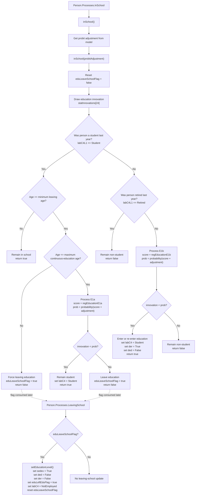

# InSchool Method Documentation

## Overview

This document describes the code logic for the `Person.inSchool()` method and its immediate schedule context in the SimPaths education module.

The flowchart is method-level rather than module-wide. It focuses on the person-level decision that determines whether an individual is treated as a student, becomes a student, remains out of education, or is flagged to leave education.

## Purpose

The `inSchool()` process updates student status decisions before education-level assignment and health processes run. It determines:

- whether a lagged student remains in education;
- whether a lagged student is flagged to leave education;
- whether a non-student enters or re-enters education;
- whether a retired person is excluded from student status;
- whether `leavingSchool()` later needs to assign an education level and remove student status.

## Code References

- `src/main/java/simpaths/model/Person.java`
  - `Person.Processes.InSchool`
  - `Person.inSchool()`
  - `Person.inSchool(double probitAdjustment)`
  - `Person.leavingSchool()`
  - `Person.setEducationLevel()`
- `src/main/java/simpaths/model/SimPathsModel.java`
  - yearly schedule block for `InSchool`, `InSchoolAlignment`, and `LeavingSchool`
  - `SimPathsModel.inSchoolAlignment()`
  - `SimPathsModel.getInSchoolAdjustment()`
- `src/main/java/simpaths/model/InSchoolAlignment.java`
  - `InSchoolAlignment.evaluate(double[] args)`
- `src/main/java/simpaths/data/Parameters.java`
  - `MIN_AGE_TO_LEAVE_EDUCATION`
  - `MAX_AGE_TO_STAY_IN_CONTINUOUS_EDUCATION`
  - `getRegEducationE1a()`
  - `getRegEducationE1b()`

## Schedule Context

In the yearly schedule, the education-status sequence is:

1. `Person.Processes.InSchool`
2. `SimPathsModel.Processes.InSchoolAlignment`
3. `Person.Processes.LeavingSchool`
4. `SimPathsModel.Processes.EducationLevelAlignment`

This matters because `inSchool()` mainly sets student status and the transient `eduLeaveSchoolFlag`. The later `leavingSchool()` process applies the final consequences for people whose `eduLeaveSchoolFlag` is true.

## State Inputs

- `labC4L1`: lagged labour/economic status, used to identify lagged students and retired persons.
- `labC4`: current labour/economic status, updated when a person remains or becomes a student.
- `demAge`: current age.
- `probitAdjustment`: alignment adjustment added to the education regression score.
- `statInnovations.getDoubleDraw(24)`: stochastic draw for the education decision.
- `Parameters.getRegEducationE1a()`: regression for lagged students deciding whether to remain in education.
- `Parameters.getRegEducationE1b()`: regression for non-students deciding whether to enter or re-enter education.
- `Parameters.MIN_AGE_TO_LEAVE_EDUCATION`: minimum age at which lagged students may leave education.
- `Parameters.MAX_AGE_TO_STAY_IN_CONTINUOUS_EDUCATION`: maximum age for continuous education under the E1a branch.

## State Changes

Within `inSchool()`:

- `eduLeaveSchoolFlag` is reset to false at the start.
- `labC4` may be set to `Les_c4.Student`.
- `der` may be set to `Indicator.True` when a non-student enters or re-enters education.
- `ded` may be set to `Indicator.False` as a precaution when a non-student enters or re-enters education.
- `eduLeaveSchoolFlag` may be set to true when a lagged student leaves education.

Within the later `leavingSchool()` process, if `eduLeaveSchoolFlag` is true:

- `setEducationLevel()` assigns an education level through process E2.
- `sedex` is set to true.
- `ded` and `der` are set to false.
- `eduLeftEduFlag` is set to true.
- `labC4` is set to `Les_c4.NotEmployed`.
- `eduLeaveSchoolFlag` is reset to false.

## Variable Glossary

This glossary is process-specific. For the full variable dictionary, see `documentation/SimPaths_Variable_Codebook.xlsx`.

| Variable | Meaning in this flowchart |
|---|---|
| `demAge` | Person's current age. Used to decide whether a lagged student is too young to leave, eligible for the E1a decision, or forced to leave continuous education. |
| `labC4` | Current four-category labour/economic status. The relevant values here are `Student`, `Retired`, and `NotEmployed`. |
| `labC4L1` | Lagged value of `labC4`. This is the main branching variable: it identifies whether the person was a student or retired in the previous period. |
| `Les_c4.Student` | Activity-status enum value for being a student. `inSchool()` sets `labC4` to this value when a person remains, enters, or re-enters education. |
| `Les_c4.Retired` | Activity-status enum value for being retired. A person who was retired last year is not allowed to become a student in this method. |
| `eduLeaveSchoolFlag` | Transient flag indicating that the person is in the pool to leave full-time education. It is set by `inSchool()` and consumed by `leavingSchool()`. |
| `ded` / `eduSpellFlag` | Indicator for being in continuous education. The `ded` accessor maps to the Java field `eduSpellFlag`. |
| `der` / `eduReturnFlag` | Indicator for returning to education. The `der` accessor maps to the Java field `eduReturnFlag`. |
| `sedex` / `eduExitSampleFlag` | Indicator related to the year/person leaving education. The `sedex` accessor maps to the Java field `eduExitSampleFlag`. |
| `eduLeftEduFlag` | Persistent flag indicating that the person has left education. Once set to true in `leavingSchool()`, it is not reset. |
| `probitAdjustment` | Alignment adjustment added to the E1a/E1b regression score before converting the score to a probability. |
| `labourInnov` | Stochastic draw from `statInnovations.getDoubleDraw(24)`. The person is assigned the positive education outcome when this draw is below the relevant probability. |
| `E1a` | Education regression process for lagged students deciding whether to remain in continuous education. |
| `E1b` | Education regression process for lagged non-students deciding whether to enter or re-enter education. |
| `E2` | Education-level assignment process applied later by `setEducationLevel()` when a person leaves school. |

## Key Branches

- Lagged student versus lagged non-student.
- Lagged student below minimum leaving age.
- Lagged student between minimum leaving age and maximum continuous-education age.
- Lagged student above maximum continuous-education age.
- Lagged retired person.
- Non-student, non-retired person evaluated by E1b.
- Alignment run versus ordinary scheduled run.

## Flowchart

## Alignment Context

`InSchoolAlignment.evaluate(double[] args)` reuses the same `Person.inSchool(double probitAdjustment)` method during root search.

For each trial adjustment value, it:

1. resets each person's current `labC4` to `labC4L1` where lagged status is available;
2. calls `person.inSchool(args[0])`;
3. calculates the difference between the target student share and the simulated student share.

The alignment target counts students aged between `MIN_AGE_TO_LEAVE_EDUCATION` and `MAX_AGE_TO_STAY_IN_CONTINUOUS_EDUCATION`, excluding people flagged to leave school.

## Notes for Debugging

- The return value of `inSchool()` indicates whether the person is a student after the method's decision, but the scheduled collection event does not use the return value directly.
- The operational link to later education processing is `eduLeaveSchoolFlag`.
- `eduLeaveSchoolFlag` is transient and is reset at the start of `inSchool()` and again after `leavingSchool()` completes.
- A lagged student above `MAX_AGE_TO_STAY_IN_CONTINUOUS_EDUCATION` is forced to leave education.
- A lagged retired person is not allowed to become a student through this method.
- In the active E1b branch, the code does not impose an explicit age upper bound before evaluating entry or re-entry into education. The aggregate alignment count is narrower because it counts the target student share only within the education age range.
- If student counts look wrong, inspect the order of `InSchool`, `InSchoolAlignment`, and `LeavingSchool` in the yearly schedule before changing the method logic.

## Flowchart Maintenance Guidance

When updating this flowchart, first check whether any of the following changed:

- the branching variable changed from `labC4L1` to `labC4` or another status field;
- the E1a or E1b regression calls changed;
- the age thresholds changed;
- `eduLeaveSchoolFlag` is set or consumed differently;
- `InSchoolAlignment.evaluate()` no longer reuses `Person.inSchool(double)`;
- `leavingSchool()` no longer performs the education-level assignment and status reset.

The diagram should remain person-based unless the code changes from per-person evaluation to a grouped or optimization-based education process.
