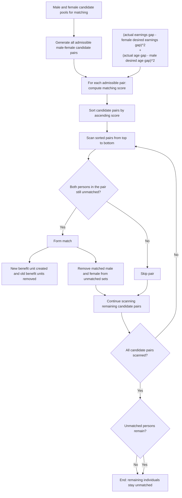

# Union Matching Documentation

## Overview

This document combines:
- the current pair-based Union Matching flowchart
- explanatory notes on the current logic
- guidance for revising the flowchart if the SimPaths code changes in future

## Current Flowchart
### Union Matching Process

## Notes

- The logic is pair-based, not woman-by-woman.
- `GlobalMatching` sorts all admissible male-female pairs by score, then scans that global list from best to worst.
- A pair is matched only if both members are still unmatched at that point in the scan.
- In the current scheduled `UnionMatching` event, unmatched persons remain unmatched after the single matching round. The no-region helper still exists in code, but the scheduled no-region fallback call is commented out.

---

## Flowchart Maintenance Guidance
### Union Matching Flowchart Guidance

## Purpose

This note explains how to update the Union Matching flowchart when the SimPaths code changes. The goal is to keep the diagram aligned with the actual matching logic while preserving a clear, high-level presentation.

## Core principle

The current Union Matching diagram should be drawn as **pair-based**, not **person-based**.

Do:
- show the algorithm as operating on admissible male-female candidate pairs
- show scores being computed for each admissible pair
- show candidate pairs being sorted globally by score
- show the sorted list being scanned from top to bottom
- show a match forming only if both members of the pair are still unmatched at that point

Do not:
- draw the algorithm as processing women one by one
- draw the algorithm as processing men one by one
- imply that a fixed ordering over women or men drives the matching

## Current code logic to preserve

At present, the flowchart should reflect the following high-level steps:

1. Build male and female candidate pools.
2. Generate all admissible male-female candidate pairs.
3. For each admissible pair, compute a matching score.
4. Sort candidate pairs in ascending order of score.
5. Scan sorted pairs from top to bottom.
6. If both people in the pair are still unmatched, form the match.
7. Remove matched male and female from further consideration.
8. Otherwise, skip the pair.
9. Continue until all candidate pairs are scanned.
10. Leave any remaining unmatched candidates unmatched after the single matching round.

## How to express admissibility

The flowchart does not need every coding detail, but it should make clear that only **admissible** male-female pairs enter scoring.

If needed, admissibility can be described in a note rather than inside the main diagram. The current code treats a pair as non-admissible if it fails any of the following:
- parent-child exclusion
- age mismatch bound
- earnings mismatch bound
- wrong sex combination for the current matching pool

Region should normally be treated as a **pool construction issue**, not a pair-admissibility issue inside the scoring box. In the current scheduled path, the no-region fallback round is not active.

## How to express the score

The flowchart may use either a compact score label or an explicit one.

Compact version:
- `compute matching score`

More explicit version:
- `(actual age gap - male desired age gap)^2 + (actual earnings gap - female desired earnings gap)^2`

If the score formula changes in code, update only the score box and keep the rest of the pair-based structure unless the algorithm itself changes.

## What to change if the code changes

### If the score formula changes
Update:
- the score box text
- any notes explaining age/earnings mismatch or whether the score uses squared or absolute penalties

Do not change:
- pair generation
- sorting
- scan order
- unmatched-set logic
unless the code also changes those parts.

### If admissibility rules change
Update:
- the note describing admissible vs non-admissible pairs
- optionally the pair-generation box label

Do not expand the main flowchart too much. Keep detailed admissibility rules in notes unless they become central to understanding the process.

### If the matching engine changes
This is the most important structural change.

If the code stops using global pair sorting, the flowchart may need redesign.
For example:
- if matching becomes woman-by-woman or man-by-man, then a person-based flowchart may become appropriate
- if matching becomes iterative random matching, the chart should show probabilistic partner selection rather than global score ordering
- if matching becomes exact optimization rather than greedy scanning, the chart should replace `scan sorted pairs` with a box describing the new optimization step

Before editing the flowchart, first answer:
- What is the unit of iteration: persons or pairs?
- Is matching driven by a globally sorted score list, by random draw, or by optimization?
- When is a candidate removed: after scoring, after matching, or by another rule?

## Recommended flowchart wording

Preferred labels:
- `Generate all admissible male-female candidate pairs`
- `For each admissible pair: compute matching score`
- `Sort candidate pairs by ascending score`
- `Scan sorted pairs from top to bottom`
- `Both persons in the pair still unmatched?`
- `Form match`
- `Remove matched male and female from unmatched sets`
- `Skip pair`
- `Continue scanning remaining candidate pairs`

Avoid labels such as:
- `For each woman, find best match`
- `For each man, find best match`
- `Remove pair from sorted list`

These are more likely to misrepresent the current logic.

## Suggested maintenance workflow

When updating the diagram in future:

1. Read the current matching code first.
   Files to inspect first:
   - `src/main/java/simpaths/model/UnionMatching.java`
   - `src/main/java/simpaths/model/SimPathsModel.java`
   - `src/main/java/simpaths/model/Person.java`

2. Identify whether the following have changed:
   - candidate pool construction
   - admissibility rules
   - score formula
   - matching algorithm
   - whether the scheduled path includes any same-region versus all-region fallback

3. Update the Mermaid source before redrawing the figure manually.

4. Regenerate the rendered flowchart and check that:
   - it remains pair-based unless the code no longer is
   - the skip/match branching is correct
   - the fallback no-region round is represented only if it is active in the scheduled path

5. If unsure, prefer a simpler diagram plus notes rather than adding too much low-level code detail to the main figure.

## Practical note

Keep two files together:
- the Mermaid source file
- the rendered image file

That way, future revisions can be made from the text source rather than redrawing the figure from scratch.

