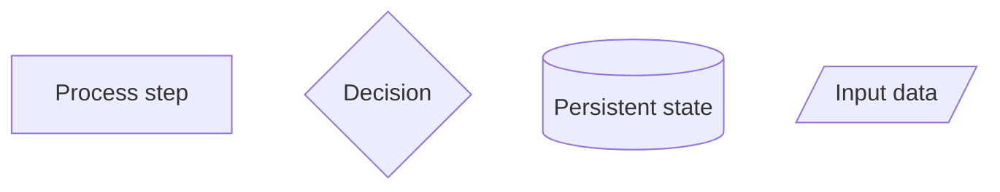
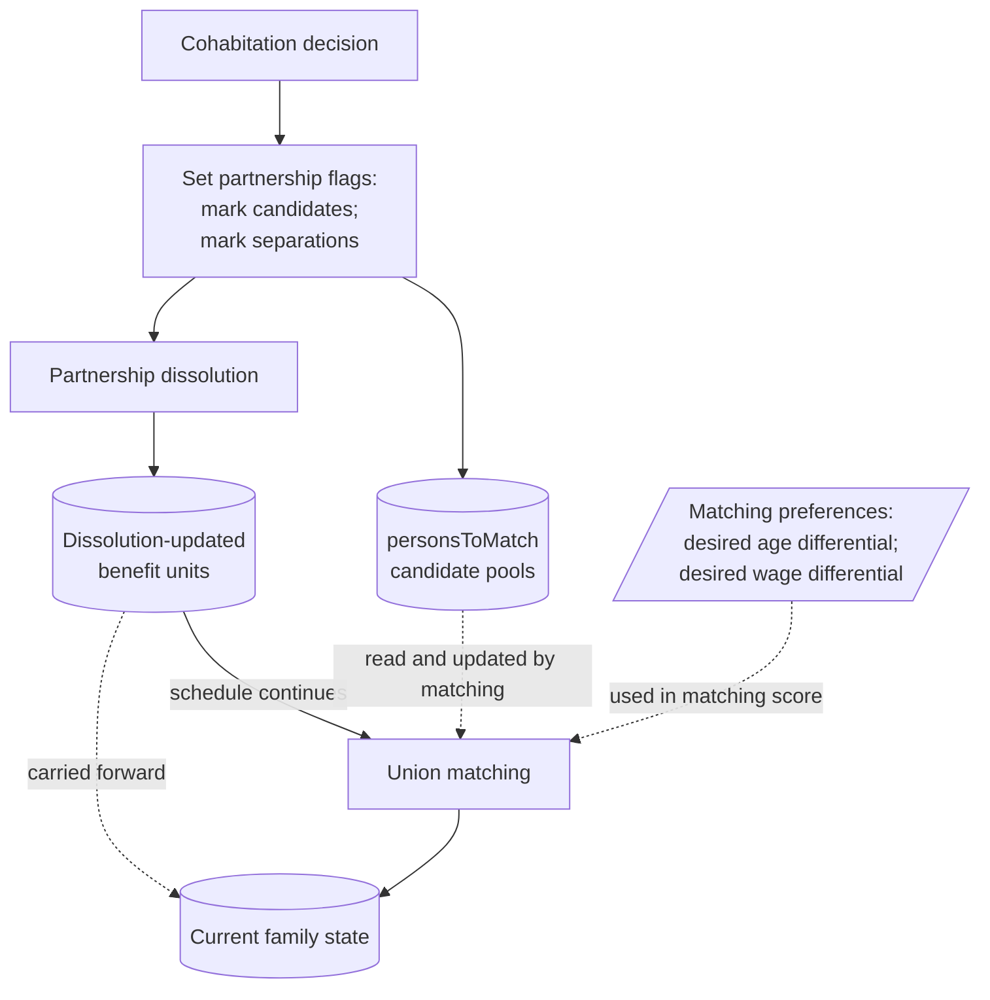

# Document Code Logic with Flowcharts

Use flowcharts to explain SimPaths code logic for debugging, review, and development. Diagrams should be traceable to Java source code: branches, method calls, inputs, state changes, and scheduled processes should not be decorative or speculative.

# 1. When to Create One

Create or update a flowchart when code is hard to inspect directly, especially for:

- multi-method or multi-class logic;
- a single complex method with many branches or state changes;
- scheduled events in `SimPathsModel`;
- alignment/test-run logic, stochastic decisions, fallback regimes, or important state mutations;
- logic that repeatedly causes debugging or review difficulty.

# 2. Storage and Manifest

Editable source files live in:

```text
documentation/flowcharts/modules/
```

Rendered SVG/PNG exports are optional and belong under:

```text
documentation/wiki/figures/modules/
```

The editable Markdown file is the source of truth. Every flowchart should have a manifest entry in:

```text
documentation/flowcharts/modules.yml
```

The manifest records flowchart path, related code files, wiki links, and update triggers.

# 3. Module File Structure

Use this structure unless a small exception is clearer:

```markdown
## Overview
## Purpose
## Code References
## Schedule Context
## State Inputs
## State Changes
## Variable Glossary
## Key Branches
## Flowchart
## Diagram Conventions
## Notes for Debugging
## Flowchart Maintenance Guidance
```

Keep variable glossaries process-specific. Link to `documentation/SimPaths_Variable_Codebook.xlsx` for the full dictionary.

# 4. Workflow

1. Identify the entry point: scheduled process, public method, event case, or alignment evaluator.
2. Trace main calls before helper details.
3. Record what each step reads, changes, and calls next.
4. Identify the unit of iteration: persons, pairs, benefit units, households, regions, years, candidate records, or sorted lists.
5. Draw the main flow first.
6. Add only branches, loops, fallback regimes, alignment/test-run paths, and stopping conditions needed to explain the logic.
7. Add a variable glossary for central or cryptic variables.
8. Add or update `documentation/flowcharts/modules.yml`.
9. Review the diagram against the code.

# 5. Structured Inputs

Use structured tools when checking `.xlsx` or similar model inputs. For Excel workbooks, prefer Python with `openpyxl` when available, or Excel/LibreOffice automation if needed. Do not infer workbook contents from filenames or ad hoc text parsing.

# 6. Mermaid Style

Use Mermaid `flowchart TD` unless another layout is clearly better.



Label rules:

- Keep labels short; put detail in notes.
- Prefer model-logic labels over Java call chains when clearer.
- Prefer positive decision labels, for example `Continuous education flag is true?`, to avoid double-negative readings.
- Avoid labels that imply state changes the code does not make.
- If an outcome has an important code handoff, include both where useful, for example `Remain unpartnered; not added to personsToMatch`.
- Make group-level coding conventions explicit, for example `female partner carries couple-level decision`.
- Use separate `<br/>` lines and semicolons for grouped state updates.

Flow and layout rules:

- Use solid arrows for control or schedule order.
- Use dotted arrows for state/data dependencies and downstream handoffs.
- Use state nodes for objects written by one process and read or updated later.
- Use input nodes for important inputs not produced inside the diagrammed block.
- If Mermaid arrows cross, first try reordering sibling branch declarations before changing the diagram.
- Declare the branch that should appear first in the rendered diagram first in the Mermaid source.
- Consolidate several upstream contributions with nodes such as `Current family state` or `Current labour-market state` to avoid implying that a later process uses only the immediately previous output.
- Be faithful to the code, but arrange the diagram for human understanding.

Example:



# 7. Update Rules

Update a flowchart when documented logic changes:

- entry point, schedule order, method calls, or unit of iteration;
- branch conditions, loops, fallback regimes, stopping conditions, or alignment/test-run behavior;
- stochastic decisions, random streams, regressions, matching, imputation, or assignment logic;
- state inputs, state changes, variable meanings, or debugging assumptions.

Minor refactors do not require redrawing if documented logic is unchanged. Redraw Mermaid when control flow changes. Update notes or glossary text when meanings, assumptions, or debugging guidance change. Update `modules.yml` when a flowchart is added, removed, renamed, or its dependencies/triggers change.

# 8. Review Checklist

Before treating a flowchart as complete, check:

- trigger and schedule position;
- Java classes and methods;
- state read and state modified;
- main branches, fallback paths, alignment/test-run paths;
- stochastic decisions or random streams;
- whether a developer can debug from it;
- whether every important claim is supported by code.

# 9. Wiki Links

Module source files live in `documentation/flowcharts/modules/`. Published docs may link to source Markdown or rendered figures under `documentation/wiki/figures/modules/`.

Module explanations usually belong in `documentation/wiki/overview/simulated-modules.md`. Link this guide from `documentation/wiki/developer-guide/how-to/index.md`.

# 10. Examples

See `documentation/flowcharts/modules.yml` for the current list. Useful examples include:

- `documentation/flowcharts/modules/union_matching.md`
- `documentation/flowcharts/modules/inschool.md`
- `documentation/flowcharts/modules/cohabitation.md`
- `documentation/flowcharts/modules/health_long_term_sick.md`
