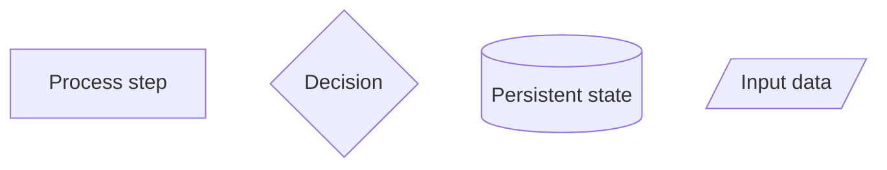

# Document Code Logic with Flowcharts

This guide explains how to document SimPaths model logic using code-facing flowcharts. The purpose is to make complex model processes easier to understand, debug, review, and maintain.

Flowcharts should describe how the code works. They should not be decorative summaries. Every branch, method call, state input, and state change shown in a diagram should be traceable to the Java source code.

# 1. When to Create a Flowchart

Create a flowchart when code logic is hard to inspect directly, especially when it has:

- logic spread across classes or methods;
- a single method with many branches, loops, or state changes;
- scheduled events in `SimPathsModel`;
- alignment/test-run logic;
- stochastic decisions;
- fallback regimes;
- important state mutations;
- repeated debugging difficulty.

Typical candidates include the annual schedule, union matching, education/in-school logic, alignment routines, tax-benefit donor imputation, initial population loading, and household or benefit-unit construction.


# 2. Storage Convention

Editable flowchart files should be stored under:

```text
documentation/flowcharts/modules/
```

Each module should have one Markdown file containing both orientation notes and an embedded Mermaid diagram, for example

```text
documentation/flowcharts/modules/union_matching.md
```

Rendered SVG or PNG files are optional. Store them under `documentation/wiki/figures/modules/` only when needed for published documentation.

The editable Markdown file is the source of truth.

Each flowchart file should also have an entry in the manifest:

```text
documentation/flowcharts/modules.yml
```

The manifest records the flowchart path, related code files, wiki links, and update triggers.


# 3. Recommended File Structure

Each flowchart file should normally use this structure:

```markdown
## Purpose

What this flowchart explains.

## Code References

Classes and methods that implement the logic.

## Schedule Context

Where this process runs, if scheduled.

## State Inputs

Model state, parameters, regressions, or random draws read by the logic.

## State Changes

Fields, collections, or objects modified by the logic.

## Variable Glossary

Short explanations of key variables used in the flowchart. Keep this process-specific and link back to `documentation/SimPaths_Variable_Codebook.xlsx` for the full dictionary.

## Key Branches

Important branches, loops, fallback regimes, alignment/test-run paths, or stopping conditions.

## Flowchart

Embedded Mermaid diagram.

## Notes for Debugging

Practical notes about where to inspect the code when results look wrong.
```

# 4. Workflow

1. Identify the entry point: scheduled process, public method, event case, or alignment evaluator.
2. Trace the main method calls before adding helper details.
3. Record what each step reads, changes, and calls next.
4. Identify the unit of iteration: persons, pairs, benefit units, households, regions, years, candidate records, or sorted lists.
5. Draw the main flow first.
6. Add only the branches, loops, fallback regimes, alignment/test-run paths, and stopping conditions needed to explain the logic.
7. Add a variable glossary for cryptic or central variables, using `documentation/SimPaths_Variable_Codebook.xlsx` where relevant.
8. Add or update the corresponding entry in `documentation/flowcharts/modules.yml`.
9. Review the diagram against the code.

# 5. Reading Structured Inputs

Use structured tools when checking model inputs such as `.xlsx` files. For Excel workbooks, prefer a workbook-aware reader such as Python with `openpyxl` when available, or Excel/LibreOffice automation if needed. Do not infer workbook contents from filenames or ad hoc text parsing.


# 6. Mermaid Style Guidelines

Use Mermaid `flowchart TD` unless there is a reason to use another layout.

Recommended node types:



Keep labels short. Use the surrounding notes to explain details.

Prefer method names where useful.


# 7. When to Update an Existing Flowchart

Update the relevant flowchart Markdown file when code changes alter any documented item:

- entry point, scheduled process, or event order;
- method calls or the unit of iteration;
- branch conditions, loops, fallback regimes, or stopping conditions;
- alignment/test-run behavior;
- stochastic decisions or random streams;
- state inputs, state changes, or variable meanings;
- regression, matching, imputation, or assignment logic shown in the diagram.

Minor implementation refactors do not require redrawing if the documented logic is unchanged. In that case, update code references or notes only if they became stale.

Redraw the Mermaid diagram when the control flow changes. Rewrite notes or glossary text when meanings, assumptions, or debugging guidance change.

Update `documentation/flowcharts/modules.yml` when a flowchart is added, removed, renamed, or when its related code files, wiki links, or update triggers change.

# 8. Review Checklist

Before treating a flowchart as complete, check that it answers these questions:

- What triggers this process?
- Where does it sit in the model schedule?
- Which Java classes and methods implement it?
- What state does it read?
- What state does it modify?
- What are the main branches?
- Are alignment/test-run branches shown?
- Are fallback regimes shown?
- Are stochastic decisions or random streams relevant?
- Can another developer use the diagram to debug the module?
- Is every important claim supported by the code?

# 9. Linking Flowcharts into the Wiki

Module flowchart source files live in:

```text
documentation/flowcharts/modules/
```

Published documentation may link to the source Markdown file or to a rendered figure under:

```text
documentation/wiki/figures/modules/
```

Module explanations usually belong in:

```text
documentation/wiki/overview/simulated-modules.md
```

For developer workflow documentation, link this guide from:

```text
documentation/wiki/developer-guide/how-to/index.md
```

# 10. Worked Examples

Current examples:

- `documentation/flowcharts/modules/union_matching.md` - module-level and algorithm-level flowchart for pair-based union matching.
- `documentation/flowcharts/modules/inschool.md` - method-level flowchart for `Person.inSchool()`.

Use these examples to see how to combine code references, state inputs, state changes, variable glossaries, Mermaid diagrams, and maintenance notes.

The manifest for these examples is:

```text
documentation/flowcharts/modules.yml
```
