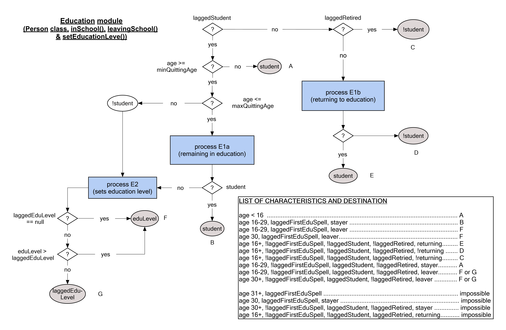
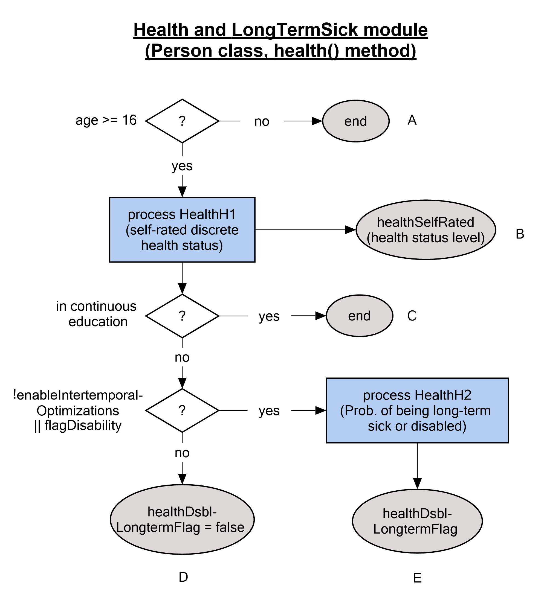
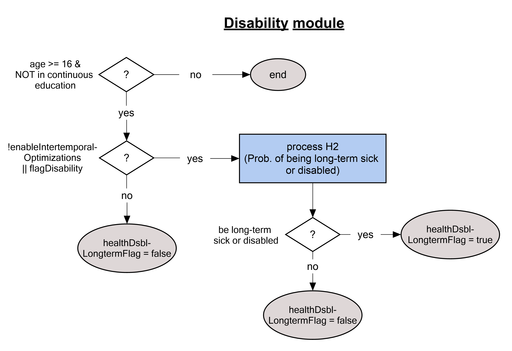
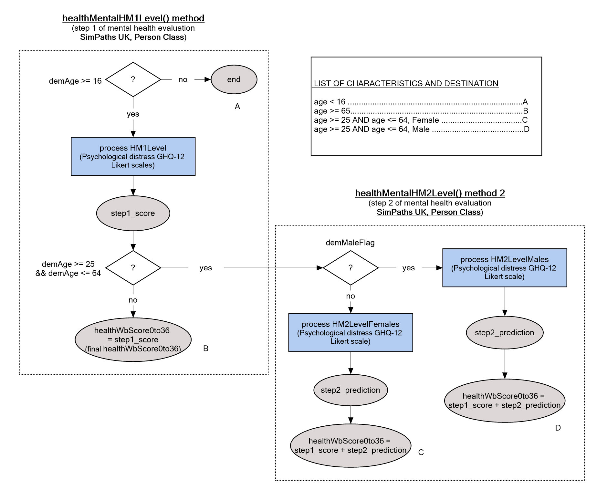
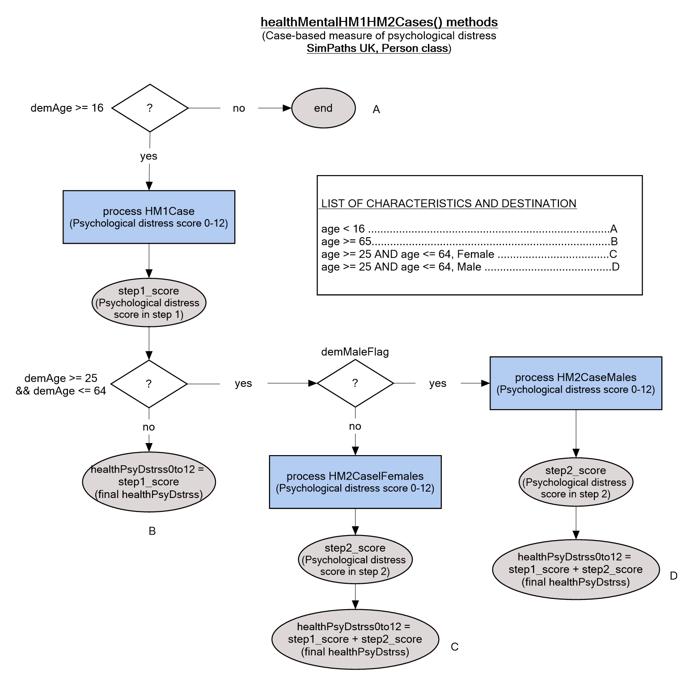
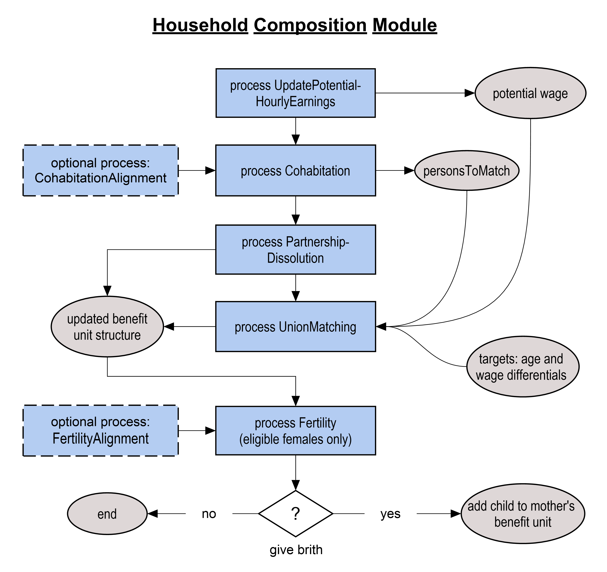
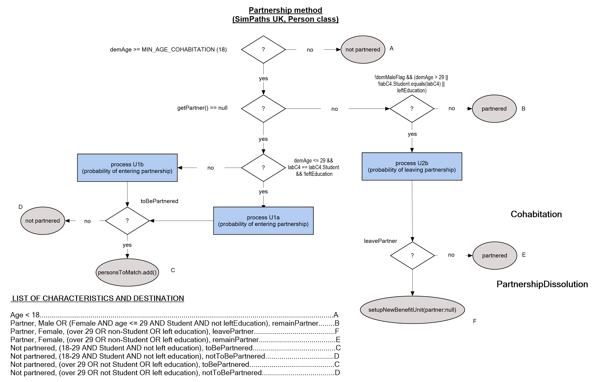
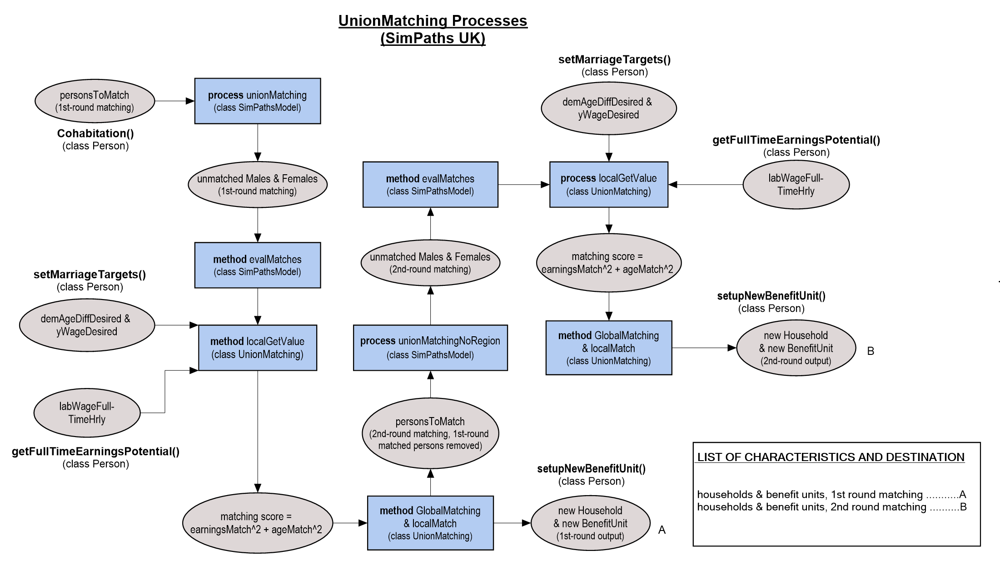
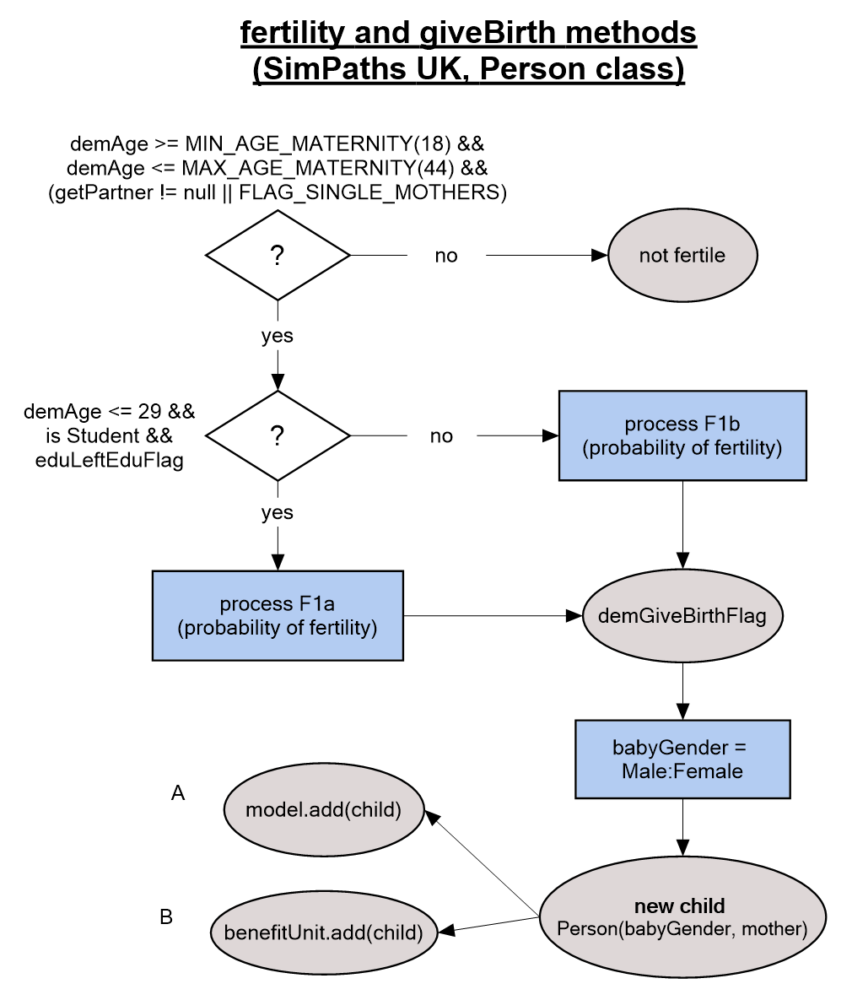

# Simulated Modules

## 1. Ageing

The first simulated process in each period increments the age of each simulated person by one year. Any dependent child that reaches an exogenously assumed “age of independence” (18 years-of-age in the parameterization for the UK) is extracted from their parental benefit unit and allocated to a new benefit unit. Individuals are then subject to a risk of death, based on age, gender and year specific probabilities that are commonly reported as components of official population projections. Death is simulated at the individual level but omitting single parent benefit units (to avoid the creation of orphans).

_Alignment_  

Population alignment is performed to adjust the number of simulated individuals to national population projections by age, gender, region, and year. Alignment proceeds from the youngest to the oldest age described by national population projections. Each age is considered in two discrete steps. First, within each age-gender-region-year subgroup, the simulated number of individuals is compared against the associated population projection. Regions with too few simulated individuals (relative to the respective target) are partitioned from those with too many. Net “domestic migration” is then projected by moving individuals from regions with too many simulated people to those with too few, until all options for (net) domestic migration are exhausted. All migratory flows are simulated at the benefit unit level, with reference to the youngest benefit unit member. 

Following domestic migration, remaining disparities between simulated and target population sizes are adjusted to reflect international immigration (if the simulated population is too small), or emigration and death (if the simulated population is too large). Like domestic migration, international migration is simulated net of opposing flows and at the benefit unit level with reference to the youngest benefit unit member. Death is simulated in preference to international emigration for population alignment for all ages above an exogenously imposed threshold (65 for the UK). 

Except for the distinction between age, gender, region, and year, all transitions simulated for population alignment are randomly distributed. This means that the model does not reflect, for example, the higher incidence of international emigration among prior international immigrants. Furthermore, the model projects international immigration by cloning existing benefit units without taking into consideration any systematic disparities between the domestic and migrant populations, including with regard to their respective financial circumstances. 

_Leaving parental home_  
Individuals who have recently attained the assumed age of independence and were moved to separate benefit units are evaluated to determine if they leave their parental home. Any individual still in education is assumed to remain a member of their parental household. For mature children not in education, the probability of leaving their parental home is based on a probit model conditional on gender, age, level of education, lagged employment status, lagged household income quintile, region, and year (to reflect observed time trends). Mature children who are projected to remain in their parental homes may leave in any subsequent year.

## 2. Education
The education module determines transitions into and out of student status. Students are assumed not to work and therefore do not enter the labour supply module. Individuals who leave education have their level of education re-evaluated and can become employed. 

 

{ width="1000" height="650" }

_Student status_  

Individuals leave continuous full-time education during an exogenously assumed age band (16 to 29 for the UK). The probability of leaving continuous full-time education within this age band is described by a probit model conditional on gender, age, mother’s education level, father’s education level, region, and year. 

Individuals who are not in education may re-enter education within another exogenously assumed age band (16 to 45 for the UK). In this case, the probability of re-entering education is described by a probit model conditional on gender, age, lagged level of education, lagged employment status, lagged number of children in the household, lagged number of children aged 0-2 in the household, mother’s and father’s education levels, region, and year. 

Students are considered not to work. Those who return to education can leave again in any subsequent year.

_Educational level_  

Individuals who cease to be students are assigned a level of education based on an ordered probit model that conditions on gender, age, mother’s and father’s education level, region, and year. The education level of individuals who exit student status after re-entering education may remain unchanged or increase but cannot decrease.

## 3. Health 

The health module projects an individual’s health status, comprising both self-rated general health and mental health metrics (based on a clinically validated measure of psychological distress using a Likert scale and a caseness indicator), and determines whether an individual is long-term sick or disabled (in which case, he/she is not at risk of work and may require social care). 

  
<b>3.1 Physical health </b>

Physical health status is projected on a discrete 5-point scale, designed to reflect self-reported survey responses (between “poor” and “excellent” health). Physical health dynamics are based on an ordered probit, distinguishing those still in continuous education. For continuing full-time students, the ordered probit conditions on gender, age, lagged benefit unit income quintile, lagged physical health status, region, and year. The same variables are considered for individuals who have left continuous education, with the addition of education level, lagged employment status, and lagged benefit unit composition.

{ width="600" height="600" }

  
<b>3.2 Long-term sick and disabled </b>

Any individual aged 16 and above who is not in continuous education can become long-term sick or disabled. The probability of being long-term sick or disabled is described by a probit equation defined with respect to lagged disability status, prevailing and lagged physical health status, gender, age, education, income quintile, and lagged family demographics.

{ width="700" height="650" }

This Disability module is integrated in the `Person.health()` (Physical health) method in the current SimPaths model. 
We split disability out for illustration purpose. 

  
<b>3.3 Psychological distress </b>

* Psychological distress 1 (baseline level and caseness)
In each simulation cycle, a baseline level of psychological distress for individuals aged 16 and over is determined using the 12-item General Health Questionnaire (GHQ-12). Two indicators of psychological distress are computed: a Likert score, between 0 and 36, estimated using a linear regression model; and a dichotomous indicator of the presence of potentially clinically significant common mental disorders  is obtained using a logistic regression model. Both specifications are conditional on the lagged number of dependent children, lagged health status, lagged mental health, gender, age, level of education, household composition, region, and year.

{ width="750" height="650" }
**Figure, psychological distress in levels**

* Psychological distress 2 (impact of economic transitions and exposure to the Covid-19 pandemic)
The baseline measures of the level and caseness of psychological distress described above are modified by the effects of economic transitions and non-economic exposure to the Covid-19 pandemic. Fixed effects regressions are used to estimate the direct impact of transitions from employment to non-employment, non-employment to employment, non-employment to long-term non-employment, non-poverty to poverty, poverty to non-poverty, and poverty to long-term poverty, as well as changes in growth rate of household income, a decrease in household income, and non-economic effect of the exposure to Covid-19 pandemic in years 2020 and 2021. The effects of economic transitions are estimated on pre-pandemic data to ensure validity in other periods. The non-economic effects of the pandemic are estimated using a multilevel mixed-effects generalized linear model. 

{ width="650" height="650" }
**Figure, psychological distress in cases**

## 4. Family composition

The family composition module is the principal source of interactions between simulated agents in the model. The module projects the formation and dissolution of cohabiting relationships and fertility. Where a relationship forms, then spouses are selected via a matching process that is designed to reflect correlations between partners’ characteristics observed in survey data. The proportion of the population in a cohabiting relationship is, by default, aligned to the population aggregate in the years for which observational data is available, to account for changes in household structure introduced by the population alignment. 

Females in couples can give birth to a (single) child in each simulated year, as determined by a process that depends on a range of characteristics including age and presence of children of different ages in the household. In case of divergence from the officially projected number of newborns, fertility rates are adapted by an alignment process to match population projections for newborn children distinguished by gender, region, and year. 

 

<b> 4.1 Family composition module code structure </b>

 
{ width="780" height="630" }

This figure illustrates the timeline of the family composition module as defined by the `buildSchedule()` method in the SimPathsModel class. 
Every year the model conducts union matching to form households and benefit unions. Specifically, the model executes:

1. Process `UpdatePotentialHourlyEarnings`, which calls `updateFullTimeHourlyEarnings()` method (`Person` class) and compute `fullTimeHourlyEarningPotentials` (used in union matching process).
2. Process `Cohabitation`, which calls `cohabitation()` method (`Person` class) and compute a group of persons to be considered in the union matching process (a map of `personsToMatch`).
3. Process `CohabitationAlignment`, which is NOT called by default.
4. Process `PartnershipDissolution` that determines which pairs of partner dissolves partnership and can be considered in the concurrent union matching process.

`onEvent()` method, **case UnionMatching**. There are three union matching approaches (SBAM, Parametric, ParametricNoRegion) in the SimPaths model. By default, the model uses the ParametricNoRegion approach, which calls unionMatching first and then the unionMatchingNoRegion methods to determine matched pairs of males and females.

`unionMatching()` method clears existing matched pairs first, then evaluates union matching for candidates in the same region. For each region, the method:

1. Creates fresh empty sets `unmatchedMales` and `unmatchedFemales`,
2. Populates these sets by copying the current period’s eligible-to-match males and females stored in the `personsToMatch` group,
3. Stores unmatched males and females in a pair of "unmatched",
4. Sends every unmatched pair to the `evalMatches()` method, which creates matched couples and removes them from the `personsToMatch` group.

`unionMatchingNoRegion()` method is executed after the `unionMatching` method updates the `personsToMatch` group. Then, this method executes union matching procedures again by relaxing the region restriction. Now all candidates in the `personsToMatch` group are evaluated in a national pool:

1. For every region, "unmatchedMales" and "unmatchedFemales" are populated with reduced `personsToMatch` group of males and females.
2. All unmatched males and females are stored in pairs of unmatched,
3. These pairs of unmatched are sent to the `evalMatches()` method.

`evalMatches()` method. It creates an object called `unionMatching` of the `UnionMatching` class. calls `unionMatching.evaluate("GM")` to execute the `GlobalMatching` algorithm, and during its execution `localMatch` is invoked for each selected pair, thereby populating `matchesHere` (consists of matched pairs) inside the `unionMatching` object. This method then removes matched pairs from personsToMatch. We discuss the `UnionMatching` class in the next section.

 

<b> 4.2 Partnerships and cohabitation </b>
  

Individuals aged 18 and over who do not have a partner may decide to enter a partnership based on the outcome of a probit model. For students, the probit conditions on gender, age, lagged household income quintile, lagged number of (all) dependent children, lagged number of children aged 0-2, lagged self-rated health status, region, and year. For non-students, the probit conditions on the same set of variables as for students, expanded to include level of education and lagged employment status. 

Individuals who enter a partnership are matched using either a parametric or non-parametric process, focussing exclusively on opposite-sex relationships. In the (default) parametric matching process, the model searches through the pools of males and females identified as cohabiting in each simulated period to minimise the distance between individual expectations, in terms of partner’s ideal earnings potential and age, and individual characteristics of each individual in the matching pool. The matching procedure (see `UnionMatching` class) prioritizes matching individuals within regions, but if the sufficient quantity and / or quality of matches cannot be achieved, matching is performed nationally. In contrast, the non-parametric process uses an iterative proportional fitting procedure to replicate the distribution of matches observed in survey data between different types of individuals, where a type is defined as a combination of gender, region, education level, and age.

 

  
<b> 4.3 Cohabitation method code structure </b>

The cohabitation method (in Person class) computes a group of persons to be considered in the union matching process (a map of personsToMatch).

{ width="1000" height="700" }

 

  
<b> 4.4 UnionMatching class code structure </b>

The `UnionMatching` class receives sets of unmatched males and females (passed as unmatched, constructed from personsToMatch) and forms new couples by creating benefit units and households via male.setupNewBenefitUnit(female, true). 

{ width="1000" height="620" }

The key method, `evaluateGM()`, implements the global matching procedure as follows:

1. Passes the current sets of unmatched males and females to the core `GlobalMatching.matching()` algorithm.
2. Constructs all feasible male–female candidate pairs using the GlobalMatchingPair class, where each pair stores: a male, a female, a matching score computed by `localGetValue(male, female)`.
3. Sorts the list of candidate pairs in ascending order of their matching score.
4. Iterates through the ranked candidate pairs from the lowest score upward. For each candidate pair, if both individuals are still unmatched, the pair is accepted: `localMatch(male, female)` is called and both individuals are removed from the availability sets. Candidate pairs involving already matched individuals are skipped.
5. For each accepted pair, `localMatch`: records the match, removes the individuals from the unmatched male and female sets, and updates the simulation state by creating a new benefit unit and household (the core purpose of the union-matching process).

`localMatch()`. This method is called as "match" in the `GlobalMatching.matching()` core algorithm. Its arguments (male, female) are candidates selected by GlobalMatching during execution. GlobalMatching.matching returns the unmatched ones (leftovers), and for each matched pair it calls `UnionMatching.match(agent1, agent2)`. This callback calls localMatch(male,female), which:

1. adds the pair to "matches" (`matches.add(...)`),
2. removes males and females in matches from the UnionMatching object’s `unmatchedMales`/`unmatchedFemales` sets (which are references to the sets passed in from `SimPathsModel.evalMatches`).
3. update simulation state:\
    3.1. set the female's region to be the male's region,\
    3.2. years in a partnership (`male/female.detDcpyy`),\
    3.3. household state via `male.setupNewBenefitUnit(female, true)`.

`localGetValue()`. This method is called as `getValue` in the `GlobalMatching.matching()` core algorithm. Its arguments (male, female) are candidate pairs considered by GlobalMatching. This method calculate the score for a pair of male and female for the sorting purpose in the `GlobalMatching.matching()`. Within the method:

1. `ageDiff` is the male's age minus the female's age,
2. `potentialHourlyEarningsDiff` is the male's full time hourly earnings potential minus the female's. In SimPaths UK, this full time hourly earnings potential is updated earlier in the yearly schedule, via the `Person.updateFullTimeHourlyEarnings()` method in each period of the simulation, before cohabitation and union matching.
3. earningsMatch is calculated as `potentialHourlyEarningsDiff` minus `female.getDesiredEarningsPotentialDiff()`, where the latter is from the `setMarrageTargets()` method in the constructor for the `Person` class, .
4. `ageMatch` is calculated as `ageDiff` minus `male.getDesiredAgeDiff()`. The latter is also from the constructor in `Person` class, `setMarrageTargets()` method.
5. If the male is not the female's father, and the female is not the male's mother, and `abs(ageMatch) < AGE_DIFFERENCE_INITIAL_BOUND`, and a`bs(earningsMatch) < POTENTIAL_EARNINGS_DIFFERENCE_INITIAL_BOUND`, the `score = earningsMatch^2 + ageMatch^2`. Else, the score is set to positive infinity to exclude such a pair.

 

  
<b> 4.5 Partnership dissolution </b>

Partnership dissolution is modeled at the benefit unit level with the probability described by a probit model conditional on female partner’s age, level of education, lagged personal gross non-benefit income, lagged number of (all) children, lagged number of children aged 0-2, lagged self-rated health status, lagged level of education of the spouse, lagged self-rated health status of the spouse, lagged difference between own and spouse’s gross, non-benefit income, lagged duration of partnership in years, lagged difference between own and spouse’s age, lagged household composition, lagged own and spouse’s employment status, region, and year. 

_Alignment_
The matching processes for new relationships outlined above fails to identify matches for all individuals flagged as entering a partnership by the related probit equations. This tends to bias the simulated population, resulting in an under-representation of partner couples. An alignment process is consequently used to match the rate of incidence of partner couples to survey targets. The alignment process works by adjusting the intercept of the probit relationships governing relationship formation, increasing the intercepts where the incidence of couples is too low.

 

  
<b> 4.6 Fertility  </b>
 

Females aged 18 to 44 can give birth to a child whenever they are identified in a partnership. The probability of giving birth is described by a probit model conditional on a woman’s age, benefit unit income quintile, lagged number of children, lagged number of children aged 0-2, lagged health status of the woman, lagged partnership status for those in continuous education. For those not in continuous education, the probability of giving birth is described by a probit model conditional on a woman’s age, the fertility rate of the UK population, benefit unit income quintile, lagged number of children, lagged number of children aged 0-2, lagged health status of the woman, lagged partnership status, lagged labour market activity status, level of education, and region. The inclusion of the overall fertility rate allows the model to capture fertility projections for future years, whereas the overall change in projected fertility is distributed across individuals according to their observable characteristics. 

 

{ width="600" height="670" }

_Alignment_
The number of projected births is aligned to the number of newborns supplied by the official projections used for population alignment. The alignment procedure randomly samples fertile women and adjusts the outcome of the fertility process until the target number of newborns has been met. 

 

## 5. Social care
The social care module projects provision and receipt of social care activities for people in need of help due to poor health or advanced age. The module is designed to distinguish between formal and informal social care, and the social relationships associated with informal care. The social care module accounts for the time cost incurred by care providers with respect to informal care, and the financial cost incurred by care receivers with respect to formal care. 

_Receipt of social care_  
The model distinguishes between individuals aged above and below an age threshold when projecting receipt of social care. This reflects the relatively high prevalence of social care received by older people, for whom more detailed information is often reported by publicly available data sources. 

_Receipt of social care among older people_  
For individuals aged above an exogenously defined threshold (65 years in the UK), the model begins by considering whether an individual is in need of care. This is simulated as a probit equation that varies by gender, education, relationship status, whether care was needed in the preceding year, self-reported health, and age. The probability of receiving care is projected using a similar set of explanatory variables. Where an individual is identified as receiving care, a multinomial logit equation is used to determine if the individual receives: i) only informal care; ii) formal and informal care; or iii) only formal care. This multinomial logit varies by education, relationship status, and age band in addition to a lag dependent variable.

For individuals projected to receive informal care, a multi-level model is used to distinguish between alternative care providers. The first level considers whether a partner provides informal care, for individuals with partners. For individuals who receive social care from their partner, the second level uses a multinomial logit to consider whether they also receive care from a daughter, a son, or someone else (other). For individuals in receipt of informal care who do not have a partner caring for them, another multinomial logit is used to select from six potential alternatives that allow for up to two carers from “daughter”, “son”, and “other”. Log-linear equations are then used to project the number of hours of care received from each identified carer. Finally, hours of formal care are converted into a cost, based on the year-specific mean hourly wages for all social care workers.

_Receipt of social care among younger people_  
Receipt of social care among individuals under the exogenously assumed age threshold is simulated using a more stylised approach to that described for older people, reflecting the less detailed data available for parameterization. In this case, the model focuses exclusively on informal social care for individuals simulated to be long-term sick or disabled. At the time an individual is projected to enter a disabled state, a probit equation is used to identify whether the individual receives informal social care. This identification is assumed to persist for as long as the person remains disabled.

If an individual under age 65 is identified as receiving social care, then the time of care received is described by a log-linear equation.

_Provision of social care_  
The model is adapted to project provision of social care by informal sector providers; the characteristics of formal sector providers of social care are beyond the current scope of the model. The approach adopted for simulating receipt of social care described above identifies the incidence and hours of informal social care that individuals are projected to receive. In the case of people over the assumed age threshold, it also identifies the relationship between those in receipt of informal social care and their informal care providers, and the persistence of those care relationships. These details consequently provide much of the information necessary to simulate provision of informal social care, in addition to the receipt of care. 

Nevertheless, the data sources for starting populations considered for SimPaths – with the notable exception of partners – generally omit social links that are implied to exist between informal social care providers and those receiving care. Specifically, links between adult children and their parents, and the wider social networks that often supply informal social care services are generally not recorded. The method that is used to project informal provision of social care is designed to accommodate limitations of the simulated data in a way that broadly reflects projection of social care receipt discussed above.

Specifically, the model distinguishes between four population subgroups with respect to provision of informal social care: (i) no provision; (ii) provision only to a partner; (iii) provision to a partner and someone else; and (iv) provision but only to non-partners. For people who are identified as supplying informal care to their partner via the process described above, a probit equation is used to distinguish between alternatives (ii: provision only to partner) and (iii: provision to a partner and someone else). Similarly, for the remainder of the population, another probit equation is used to distinguish between alternatives (i) and (iv). A log linear equation is then used to project number of hours of care provided, given the classification of who care is provided to.

## 6. Investment income 

The investment income module projects income from investment returns and (private) pensions. The approach taken to project these measures of income depends upon the model variant considered for analysis. Where consumption/savings decisions are simulated using a structural behavioural framework, then asset income is projected based on accrued asset values and exogenously projected rates of return. Alternatively, computational burden of model projections can be economised by proxying non-labour income without explicitly projecting asset holdings. 

_Retirement_  
Simulation of retirement varies slightly depending on the accommodation of forward-looking expectations. In both cases, retirement is possible for any adult above an assumed age threshold (50 in the parametrisation for the UK). When forward-looking expectations are implicit, entry to retirement is based on a probit model that controls for gender, age, education, lagged employment status, lagged (benefit unit) income quintile, lagged disability status, indicator to distinguish individuals in excess of state pension age (accounting for changes in the state pension age), region, and year. For couples, characteristics of the spouse (employment status, reaching retirement age) also affect the probability of retirement. When forward-looking expectations are explicit, then entry to retirement is considered to be a control variable. Retired individuals may receive pension income.

_Private pension income_  
When wealth is implicit in the model, then private pension income is projected using a linear regression model that conditions on age, level of education, lagged household composition, lagged health status, lagged private pension income, region, and year for individuals who continue in retirement. For individuals entering retirement, the probability of receiving private pension income is first determined using a logit model that conditions on having reached the state pension age, level of education, lagged employment status, lagged household composition, lagged health status, lagged hourly wage potential, region, and year. The amount of pension income is projected using a linear regression model conditional on the same observed characteristics. 

When the simulation projects wealth explicitly, then an assumed fraction of benefit unit wealth at the time of retirement is converted into a life annuity, or joint-life annuity for adult couples. Annuity rates in the model are actuarily fair, given (cohort specific) mortality rates and an assumed internal rate of return.

_Capital income_  
When wealth is not projected by the model, then the incidence of capital income among the simulated population aged 16 and over is based on probabilities described by a logit regression equation that varies by age, lagged health, lagged gross employment and capital income, region and year. For individuals not in continuous education, the list of explanatory variables for the logit equation also includes education status, lagged employment status, and lagged household composition. 

For individuals simulated to be in receipt of capital income, the amount of capital income is described by linear regression models that condition on gender, age, lagged health status, lagged gross employment income, lagged capital income, region, and year for individual in continuous education. Individuals not in continuous education are also distinguished by their level of education, lagged employment status, and lagged household composition.

When wealth is explicitly projected by the model, then capital income is the product of net asset holdings and an assumed rate of return. The rate of return varies by year, and by the value of benefit unit net wealth, $w_{i,t}$, as described by:

$r_{i,t} = r_{a,t}$ if $w_{i,t} >= 0$ and  
$r_{dl,t} + (r_{du,t} - r_{dl,t}) \phi_{i,t}$ otherwise

where $i$ denotes the benefit unit and $t$ denotes time. $1 \ge \phi_{i,t} \ge 0$ denotes the (bounded) ratio of benefit unit debt to full-time potential earnings. Assuming $r_{du,t} \ge r_{dl,t}$ reflects a ‘soft constraint’ where interest rates increase with indebtedness.

## 7. Labour income 
The labour income module projects potential (hourly) wage rates for each simulated adult in each year and their associated labour activity. Given potential wage rates, hours of paid employment by all adult members of a benefit unit are generated. Labour (gross) income is then determined by multiplying hours worked by the wage rate. 

_Wage rates_  
Hourly wage rates are simulated for each adult in the model based on Heckman-corrected regressions stratified by gender and lagged employment status (distinguishing between employed and not-employed individuals) that include as explanatory variables, part-time employment identifiers, age, education, student status, parental education, relationship status, presence of children, health, and region. For individuals observed in employment in the previous year, lagged (log) hourly wage rates are also included as an explanatory variable. 

_Employment decisions_  
Two alternative methods for projecting employment decisions can be considered by the model. These alternatives are both designed to reflect the influence of financial incentives on behaviour and are distinguished by whether they reflect forward-looking expectations.

The default specification of SimPaths projects labour supply using a non-forward-looking random utility model. The method projects labour supply as though employment decisions are made to maximise within-period benefit unit utility over a discrete set of labour/income alternatives. Given any labour alternative, labour income is computed by combining hours of work with the respective hourly wage rate. The utility of the benefit unit is calculated using a quadratic utility function and takes as arguments benefit unit disposable income and the number of hours worked by adult members. The UK labour supply model is estimated using UKMOD in combination with UKHLS data for 2019/20. The estimation employs an alternative-specific conditional logit approach (Stata command asclogit). Below a more detailed description of the model is provided. 
 
Labour-supply-flexible individuals are defined as those of working age (15-75 years) who are not students, not disabled (and not on disability benefits), not pensioners, and who do not have a partner or are partnered with a non-flexible individual. Couples are those where both partners satisfy the flexible-worker conditions.

Formally, each labour-supply-flexible individual chooses among seven mutually exclusive alternatives: non-employment and six weekly hours categories. The definition of alternatives is as follows:
- Alternative 0: Weekly hours: 0  Category: Non-employment
- Alternative 1: Weekly hours: 10 Category: 6-15 hours
- Alternative 2: Weekly hours: 20 Category: 16-25 hours
- Alternative 3: Weekly hours: 30 Category: 26-35 hours
- Alternative 4: Weekly hours: 38 Category: 36-40 hours
- Alternative 5: Weekly hours: 45 Category: 41-49 hours
- Alternative 6: Weekly hours: 55 Category: 50+ hours

In couples’ cases, the choice set expands into all combinations of the two partners’ options.

The observed choice, together with simulated incomes and computed leisure, identifies the utility parameters.

Leisure is computed as total weekly hours minus the worked-hours bracket minus hours spent providing care. The idea is that caregiving is a time cost and should reduce leisure in the utility function.

Disposable income for each alternative is simulated using UKMOD as follows. 
Hourly wages are predicted using a Heckman two-step selection model based on UKHLS-UKMOD panel data. The model is estimated separately for individuals with and without previous employment, and within each group separately for men and women. Predicted wages are used for all individuals as this approach performs better than the alternative one (using predicted wages for non-workers only). The predicted hourly wage is then used to compute employment income for each hour's alternative.  

To correctly simulate disposable income for each hours scenario, we follow these conventions:
- Benefits that UKMOD can simulate (e.g. Universal Credit, tax credits) ==> rely on UKMOD to produce for every hour's alternative.
- Benefits that UKMOD cannot simulate and that are dependent on employment income ==> set to zero for all counterfactual alternatives (otherwise they would appear only in the observed alternative and distort utility estimation).
- Benefits UKMOD cannot simulate and that are not dependent on employment income and are compatible with work ==> copy the observed amount to all alternatives.
- Benefits incompatible with work but received in the observed state ==>  drop the individual from the estimation sample (e.g. this applies to some disability benefits, their presence implies some choices are not feasible).

UKMOD calculates disposable income for each scenario, and the individual's observed choice identifies which of the seven alternatives they actually selected.

The estimation sample is split into subsamples, and the asclogit is used to estimate the marginal utilities of income and leisure and the preference shifters for each of these subsamples: 
- Single females
- Single males
- Couples where both partners are flexible 
- Singles with a non-flexible partner, females
- Single with a non-flexible partner, males
- Adult children, females
- Adult children, males
In practice, limited sample sizes forced us to pool the sexes for couples with one flexible partner and for adult children. 

Utility is modelled as a quadratic function of disposable income and leisure. 
- In the models for single women and single men, a dummy for full-time work is included to capture any fixed utility shift associated with full-time employment. The specification also conditions on an individual-level characteristic, years spent in employment, to account for accumulated labour-market experience.
- In the couples’ model, full-time work dummies and previous labour-market experience variables are included for both partners. 
- In the model for singles with a dependent non-flexible partner, men and women are estimated jointly, and differences by sex are accounted for by interacting the full-time work dummy with a sex dummy.
- In the model for adult children, the sample is also pooled, with an interaction between sex and full-time work, but previous labour-market experience is not included as it was not statistically significant.

The model can also be directed to project labour and discretionary consumption to reflect forward-looking expectations for behavioural incentives. As for the implicit expectations case, the unit of analysis is the benefit unit. Incentives are translated into behaviour via an assumed intertemporal utility function. By default, the model adopts a nested constant elasticity of substitution (CES) utility function.

Each adult is considered to have three alternative labour supply options, corresponding to full-time, part-time and non-employment. Labour supply and discretionary consumption are projected as though they maximise the assumed utility function, subject to a hard constraint on net wealth and assumed agent expectations. Expectations are “substantively rational” in the sense that uncertainty is characterised by the random draws that under dynamic projection of modelled characteristics. As no analytical solution to this problem exists, numerical solution methods are employed.

The model proceeds in two discrete steps. The first step involves solution of the lifetime decision problem for any potential combination of agent specific characteristics, with solutions stored in a look-up table. The second step uses the look-up table as the basis for projecting labour supply and discretionary consumption.

_Alignment_  
When the default specification of SimPaths for projecting labour supply is used, the estimated utility of single men, single women, and couples is adjusted to align the aggregate employment rate to the employment rate observed in the data in the validation period. The final adjustment value is used in the subsequent periods, for which no data is available. This procedure accounts for the existence of unemployment in the real economy and the fact that labour supply decisions simulated using the random utility model assume no constraints on labour demand in the economy. 

## 8. Disposable income 
Disposable income is simulated by matching each simulated benefit unit in each projected period with a donor benefit unit reported by a tax-benefit reference database, following the procedure described by [van de Ven et al. (2022)](https://www.iser.essex.ac.uk/wp-content/uploads/files/working-papers/cempa/cempa3-22.pdf). The database stores details of taxes and benefits alongside associated demographic and private income characteristics for a sample of benefit units. This database could be populated from a wide range of sources. The approach was originally formulated to draw upon output data derived from the UK version of EUROMOD (UKMOD), and then extended to accommodate projections from any EUROMOD country. 

The matching procedure for benefit units applies coarsened exact matching over a number of discrete-valued characteristics, followed by nearest-neighbour matching on a set of continuous variables. The nearest neighbour matching is performed with respect to Mahalanobis distance measures evaluated over multiple continuous valued characteristics. 

The default set of discrete value characteristics considered for matching includes age of the benefit unit reference person, relationship status, numbers of children by age, hours of work by each adult member, disability status, and informal social care provision. Similarly, the default set of continuous value matching characteristics includes original (pre-tax and benefit) income, second income (to allow for income splitting withing couples), and formal childcare costs. 

Having matched a simulated benefit unit to a donor, disposable income is imputed via one of two methods. For benefit units with original income above a “poverty threshold”, disposable income is imputed by multiplying original income of the simulated benefit unit by the ratio of disposable to original income of the donor unit. For benefit units below the considered poverty threshold, disposable income is set equal to the (growth adjusted) disposable income of the donor.

Finally, adjustments to account for public subsidies for the costs of (formal) social care are evaluated separately from the database approach described above, based on internally programmed functions. This is done because public subsidies for social care are not always included in database sources (e.g. tax-benefit models) considered for analysis. 
 

## 9. Consumption
Given disposable income and household demographics, the consumption module projects measures of benefit unit expenditure. Where the model projects wealth, then a simple accounting identity is used to track the evolution of benefit unit assets through time. A regression-based homeownership process predicts if the primary residence is owned by either of the responsible adults in a benefit unit, in which case the benefit unit is considered to own its home. 

_Non-discretionary expenditure_  
The model can project two forms of non-discretionary benefit unit expenditure: formal social care costs and formal childcare costs. Social care costs are projected based on projections of hours of formal social care received and assumed hourly wage rates for social care workers. 

Childcare costs are projected using a double-hurdle model, characterised by a probit function describing the incidence of formal childcare costs and a linear least-squares regression equation describing the value of childcare costs when these are incurred. Both equations include the same set of explanatory variables describing the number and age of dependent children in a benefit unit, the relationship status and employment status of adults in the benefit unit, whether any adult in the benefit unit is higher educated, region, and year.

_Discretionary consumption_  
The model can be directed to project employment and discretionary consumption jointly to reflect forward-looking expectations for behavioural incentives. The projection of discretionary consumption varies depending on whether forward-looking expectations are chosen to be explicit or implicit within a simulation.

By default, yearly equivalised disposable income is calculated by adjusting disposable income to account for benefit unit demographic composition via the modified OECD scale. Equivalised consumption is set equal to equivalised disposable income for retired individuals, and to disposable income adjusted by a fixed discount factor to account for an implicit savings rate otherwise. The assumed savings rate, in turn, influences simulated capital income.

When expectation are explicit, the model evaluates solutions to the lifetime decision problem in the form of a look-up table when directed to reflect forward-looking expectations for behavioural incentives. In the case of discretionary consumption, the look-up table stores the ratio of consumption to “cash on hand”, where cash on hand is the sum of net wealth, disposable income, and available lines of credit. This ratio has the advantage that it is bounded between zero and one, which facilitates the computational routines and consideration of selected policy counterfactuals.

_Assets accumulation_  
Net wealth is the key transition mechanism that balances intertemporal behavioural incentives when forward-looking expectations are treated explicitly by the model. In this case, dynamic evolution of wealth in most periods is described by the accounting identity:

$w_{i,t} = w_{i,t-1} + y_{i,t} - c_{i,t} - \bar{c}_{i,t}$

where $w_{i,t}$ denotes the net wealth of benefit unit $i$ in period $t$, $y_{i,t}$ disposable income, $c_{i,t}$ discretionary consumption, and $\bar{c_{i,t}}$ non-discretionary expenditure. The only departures from equation above are at the time of retirement if $w_{i,t} > 0$, when a fixed fraction of net wealth is converted into a fixed life annuity.

_Homeownership_  
Although net wealth is not disaggregated in the model, the incidence of homeownership is reflected, as this is used as an input to for projection of psychological distress. Homeownership is evaluated at the benefit unit level, by considering if at least one of the adult occupants is classified as a homeowner. At the individual level, homeownership is determined using a probit regression model conditional on gender, age, lagged employment status, education level, lagged self-rated health, lagged benefit unit income quintile, lagged gross personal non-employment non-benefit income, region, lagged household composition, lagged spouse’s employment status, and a time trend. 
 

## 10. Mental health 

A secondary subjective-wellbeing process adjusts estimates obtained by the primary process to account for the effect of exposure to labour market transitions, such as moving in and out of employment and/or poverty. 
Specifically, in the SimPaths model, method `Person.healthMentalHM2level()` corresponds to the Step 2 of such a mental health evaluation, as illustrated in the right half of the Figure 1 below:

{ width="750" height="650" }
**Figure 1, psychological distress in levels**

The first and second processes for mental health in cases are combined, as illustrated in Figure 2, where processes `HM2CasesFemales` and `HM2CasesMales` correspond to the second process. 

{ width="650" height="650" }
**Figure 2, psychological distress in cases**
 

## 11. Statistical display 
At the end of each simulated year, SimPaths generates a series of year specific summary statistics. All of these statistics are saved for post-simulation analysis, with a subset of results also reported graphically as the simulation proceeds. 
