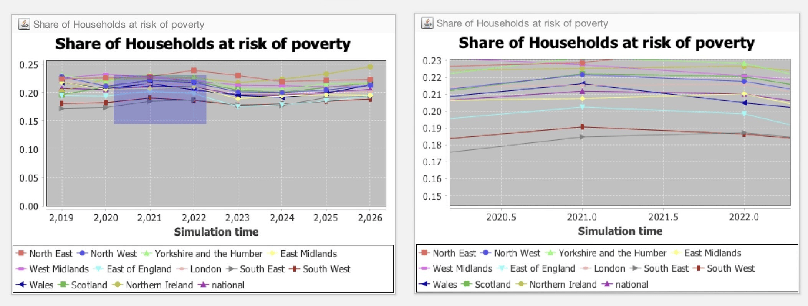

# The Graphical User Interface

# 1. Introduction
In this section, we discuss the different components that make up the JAS-mine Graphical User Interface (GUI).


JAS-mine supports three different types of execution mode:- [interactive mode](https://www.microsimulation.ac.uk/jas-mine/resources/cookbook/start/), [batch mode](https://www.microsimulation.ac.uk/jas-mine/resources/cookbook/start/) and [multi-run mode](https://www.microsimulation.ac.uk/jas-mine/resources/tutorials/run-a-simulation-many-times/). The most common mode for prototyping a JAS-mine project, developing an intuition about how it works and demonstrating it to an audience is the interactive mode. This features a graphical user interface, where model parameters can be set and updated during a simulation run, and pre-determined graphical objects can be displayed to allow for real-time inspection of a number of the model's output quantities.

The interactive mode is launched by default when executing the Start class of a standard JAS-mine project (as created using the JAS-mine Plugin for Eclipse IDE tool). In order to turn off the GUI when using a standard JAS-mine project, the user should go to the main method in the project's Start class, and ensure that the Boolean variable `showGUI` (defined in the first line of the main method) is set to false:
```java
public static void main(String[] args) {  

    boolean showGui = true;    // Toggle GUI on (off) by setting showGUI to true (false) 
    SimulationEngine engine = SimulationEngine.getInstance(); 
    MicrosimShell gui = null;
    if (showGui) { 
        gui = new MicrosimShell(engine);
        gui.setVisible(true); 
    }  
    engine.setBuilderClass(StartDemo.class);
    engine.setup();
}
```

# 2. Components

## 1.1 Menus


There are three menu tabs at the top of the JAS-mine:

* Simulation – this menu contains a list of the buttons that appear in the Simulation Control Pane below the Menu tabs, plus the simulation's engine status (which includes information about the simulation run number, random number seed and event list references).
* Tools – contains the '**[Database explorer](https://www.microsimulation.ac.uk/jas-mine/resources/cookbook/queries/)**' that opens up the web browser to interact with the simulation's input or output databases (if any).  This also includes the 'Print windows positions' tool that prints to the output stream window the co-ordinates of the corner positions of all widgets (parameter boxes and graphs) in the main graphical window.
* Help – features the 'About JAS-mine' option that opens up a window containing credits for JAS-mine and the terms of the GNU LESSER GENERAL PUBLIC LICENSE, in addition to information about the system environment being used to run JAS-mine simulations such as the memory allocated to the Java Virtual Machine and the version of Java.

## 1.2 Simulation Control Pane


Below the Menu tabs are the simulation control buttons. The user can easily discover the meaning of each of the buttons by hovering the mouse pointer over each button. We describe the actions associated with each button below, ordered from left to right:

* **Restart simulation model**
* **Build simulation model** – builds the simulation model so that it can be executed.
* **Start simulation** – starts the execution of the simulation (note that the model must be built before it can be executed – this is done by clicking on the 'Build simulation model' button to the immediate left).
* **Execute next scheduled action** – if the simulation is paused (see Pause button to the immediate right), by clicking on this button, the user can execute the next action scheduled in the simulation. This allows the user to perform a step-by-step execution of the simulation. To continue the simulation as normal, press the 'Start simulation' button again.
* **Pause simulation** – pauses the simulation model. Press the 'Start simulation' button to continue the simulation.
* **Update parameters in the live simulation** – if the user desires to change some of the [GUI parameters](https://www.microsimulation.ac.uk/jas-mine/resources/cookbook/gui-parameters/) (see 'Parameter Boxes' below) while the simulation is still running, first update the values of the GUI parameters and then click on this button. This is useful, for example, in seeing the impact of step changes in the parameters on the equilibrium state of a simulation model. Note that only parameters that are accessed by the model during the simulation after the update button has been clicked can have any impact on the simulation. For example, if a simulation uses a GUI parameter to determine the size of an agent population at the start of the simulation, and the population is subsequently evolved, the population size will not change despite the population size parameter having been updated if this parameter is only ever used by the model at the start of the simulation. In order to have a population size parameter that affects population size during the simulation, the model developer would need to explicitly code the simulation to check the size of the population at scheduled times during the simulation, and delete / create agents if the population size differs from the population size parameter.

In addition, the toggle box **'Turn off database'** disables JAS-mine's [object-relational mapping](https://www.microsimulation.ac.uk/jas-mine/resources/focus/object-relational-mapping/) to the relational database management system. In this way, simulations with this toggle box ticked are running JAS-mine 'lite' – a lighter version without any of the database machinery. This may be useful if, for example, the user has no need of input or output databases in their simulation, and they want a way of reducing the memory requirements of their simulation and to potentially increase the speed of execution. Note that an exception will be thrown if a model requiring data from an input database is attempted to be built whilst the 'Turn off database' toggle box is ticked.

The sliding scale on the right labelled **'Simulation speed'** adjusts the real-time speed in which the simulation is executed. The default speed is set to the maximum (and so is only limited by the processor speed of the computer on which the simulation is running), however the simulation can be slowed down by dragging the slider to the left – this may be useful for example when demonstrating a model to an audience when it is desired to slow down the updates of the graphs.

## 1.3 Parameter Boxes

A JAS-mine model's *[GUI parameters](https://www.microsimulation.ac.uk/jas-mine/resources/cookbook/gui-parameters/)* appear in the parameter boxes below the Simulation Control Pane.  One parameter box for each of the '[Model-Collector-Observer](https://www.microsimulation.ac.uk/jas-mine/resources/focus/model-collector-observer/)' manager classes is displayed, as long as there are any variables in each of the manager classes that have the `@GUIparameter` annotation.


The description of a GUI parameter can be observed by hovering the mouse pointer over the value, upon which a yellow box containing the description appears if it has been defined as an attribute in the `@GUIparameter` annotation where the variable is declared, e.g.:
```java
@GUIparameter(description = "Country to be simulated")
private Country country = Country.IT;
```

The type of parameters determines the way they are presented in the boxes, with boxes to hold numerical values, tick boxes for Boolean 'toggle' variables, and drop down menus enumerating categories. In the figure above, the Country drop down menu appears after clicking on the value to the right of the Country label (Country is an Enum variable that can hold one of a finite set of values). The default values in the parameter boxes are the values hard-coded to the GUI parameters in the manager classes. If the user wants to change the default values of the GUI parameters, this must be done in the code.

The GUI parameters can be adjusted from their default values before the model is built, or even during the execution of the simulation, although in this latter case the 'Update parameters in the live simulation' button in the Simulation Control Pane must be clicked for any parameters in the simulation to be updated. This is useful, for example, in seeing the impact of step changes in the parameters on the equilibrium state of a simulation model. Note that only parameters that are accessed by the model during the simulation after the update button has been clicked can have any impact on the simulation. For example, if a simulation uses a GUI parameter to determine the size of an agent population at the start of the simulation, and the population is subsequently evolved, the population size will not change despite the population size parameter having been updated if this parameter is only ever used by the model at the start of the simulation. In order to have a population size parameter that affects population size during the simulation, the model developer would need to explicitly code the simulation to check the size of the population at scheduled times during the simulation, and remove / add agents if the population size differs from the population size parameter.

## 1.4 Graphical Widgets (Charts)

Below the parameter boxes in the main pane with the blue background, a variety of graphics can be produced in the JAS-mine GUI, including time-series plots, histograms and geographical maps. For information on the currently supported graphics, see the JAS-mine GUI's Plot, Colormap and Space packages in the [API](https://www.microsimulation.ac.uk/jas-mine/resources/api/) documentation; for how to feed the graphical widgets, see the JAS-mine [statistical package](https://www.microsimulation.ac.uk/jas-mine/resources/tutorials/how-to-use-the-jasmine-statistical-package/).

The graphics do not immediately appear in the GUI when the JAS-mine project's Start class is executed; the project must be built first by clicking on the 'Build simulation model' button in the Simulation Control Pane.

The settings of a graphical widget can be adjusted by right clicking on it with the mouse pointer, and selecting the appropriate controls that are available for the type of widget. For example, the labels, line-type, colour and appearance of time series plots can be altered while running the simulation as shown below:


In addition, for a time series plot, it is possible to zoom in to areas of data points by left-clicking and dragging the mouse pointer diagonally downwards and to right in order to select a rectangle of area to enlarge. The left hand side of the figure below shows the rectangle created by dragging the mouse pointer (the mouse pointer is not shown), and the right hand side is the resulting enlarged chart. The user can zoom out again either by dragging the mouse pointer upwards or leftwards, or by right clicking and selecting 'Auto Range -> Both Axes' from the list of options.



Finally, the time series plots can be saved as a PNG file, printed or copied by right clicking on the chart and selecting the relevant option.

## 1.5 Output stream

The output stream is the white coloured window at the bottom of the GUI. It contains the system and debugger out-stream data that would be printed out to the Command Prompt (in Windows), the Terminal (Linux), or in Eclipse if running in batch mode without the GUI. Such output includes any data produced by `System.out.println()` or `System.err.println()` commands in Java, and also information about the creation of database tables when building the project. The stack trace of any exceptions thrown will be printed out. The buttons on top of the output stream window include an option to save the text to file.

